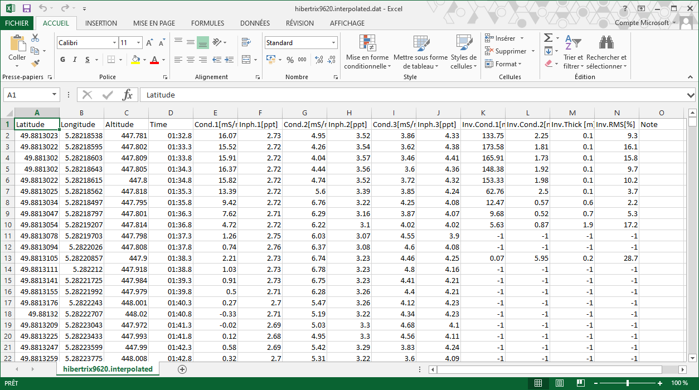

# Rappel théorique

# Aquisition de données sur le terrain

# Analyse et intérprétation de données
Ici, nous allons voir comment procéder a l'analyse d'un jeux de données électromagnétique. Le format des données utilisé est tel que sorti de l'appareil disponible au labvoratoire de géophysique appliquées de l'Université de Liège: [CMD-Mini Explorer de GF Instruments](http://www.gfinstruments.cz/index.php?menu=gi&cont=cmd_ov) (en anglais).
## 1) Analyse du jeux de données
### Ouvrir le jeux de données
Les jeux de données EM sont présenté sous forme de fichiers texte ayant une tabulation comme séparateur ayant pour extension \*.dat. Ces fichiers peuvent être ouvert dans un tableur (Excel, Calc, Sheet) (*Fig.1*). Selon l'appareil de mesure, le nombre de colonnes peut varier. Il y aura toujours les colonnes *Latitude*, *Longitude*, *Altitude* et *Time*. Les autres colonnes représentent les données mesurées:
- Cond.*n* [mS/m]: La conductivité mesurée, en milliSiemens/mètre
- Inph.*n* [ppt]: Le ratio en phase du signal mesuré, en part par millier (parts-per-thousand).

Selon l'appareil utilisé, ces colonnes sont répétées *n* fois pour rendre compte de la mesure simultanée sur *n* boucles de mesures. Ensuite, plusieurs colonnes présentent les résultats (si ils sont calculé par l'appareil) d'une inversion simplifiée des données: *Inv.Cond.1[mS/m]*, *Inv.Cond.2[mS/m]*, *Inv.Thick [m]* et *Inv.RMS[%]*.
Ce résultat d'inversion est rarement utilisé car peut précis et fiable. En effet, l'inversion des données éléctromagnétique est un sujet très complexe qui est sujet a de très fortes hypothèses, rarement rencontrées. 

*Fig. 1* Exemple de fichier de données brut

### Trier les données
Avant de procéder à l'interprétation du jeux de donnée, il faut vérifier que le jeux de données en question est de bonne qualité. Pour faire cela, on peut faire de simples histogrames pour les différents paramètres mesuré. Normalement, le comportement des données devrait être relativement homogène (on ne s'attends pas a avoir des valeurs extrêmes qui soient unique).

