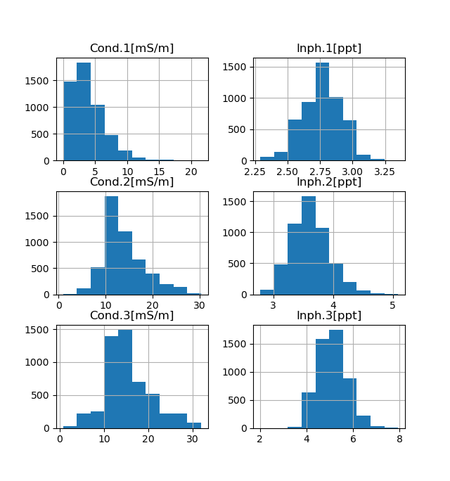

# Rappel théorique

# Aquisition de données sur le terrain


# Analyse et intérprétation de données
Ici, nous allons voir comment procéder a l'analyse d'un jeux de données électromagnétique. Le format des données utilisé est tel que sorti de l'appareil disponible au labvoratoire de géophysique appliquées de l'Université de Liège: [CMD-Mini Explorer de GF Instruments](http://www.gfinstruments.cz/index.php?menu=gi&cont=cmd_ov) (en anglais).
## 1) Analyse du jeux de données
### Ouvrir le jeux de données
Les jeux de données EM sont présenté sous forme de fichiers texte ayant une tabulation comme séparateur ayant pour extension \*.dat. Ces fichiers peuvent être ouvert dans un tableur (Excel, Calc, Sheet) (*Fig. 1*). Selon l'appareil de mesure, le nombre de colonnes peut varier. Il y aura toujours les colonnes *Latitude*, *Longitude*, *Altitude* et *Time*. Les autres colonnes représentent les données mesurées:
- Cond.*n* [mS/m]: La conductivité mesurée, en milliSiemens/mètre
- Inph.*n* [ppt]: Le ratio en phase du signal mesuré, en part par millier (parts-per-thousand).

Selon l'appareil utilisé, ces colonnes sont répétées *n* fois pour rendre compte de la mesure simultanée sur *n* boucles de mesures. Ensuite, plusieurs colonnes présentent les résultats (si ils sont calculé par l'appareil) d'une inversion simplifiée des données: *Inv.Cond.1[mS/m]*, *Inv.Cond.2[mS/m]*, *Inv.Thick [m]* et *Inv.RMS[%]*.
Ce résultat d'inversion est rarement utilisé car peut précis et fiable. En effet, l'inversion des données éléctromagnétique est un sujet très complexe qui est sujet a de très fortes hypothèses, rarement rencontrées. 

  
*Fig. 1* Exemple de fichier de données brut

### Trier les données
Avant de procéder à l'interprétation du jeux de donnée, il faut vérifier que le jeux de données en question est de bonne qualité. Pour faire cela, on peut faire de simples histogrames pour les différents paramètres mesuré. Normalement, le comportement des données devrait être relativement homogène (on ne s'attends pas a avoir des valeurs extrêmes qui soient unique).

Pour analyser les valeurs, nous allons utiliser des histogrammes. En effet, ils sont un moyen simple et efficace d'analyser les distributions de mesures effectuées. L'histogram du jeux de donné exemple dans son état initial est donné en *Fig. 2*. On y voit que deux choses significatives:
- La conductivité montre des valeurs parfois négatives, ce qui est physiquement impossible.
- Certaines valeurs sont largement en dehors de la distribution.

  
*Fig. 2* Histogrammes initiaux pour le jeux de données exemple. On y voit de nombreux outliers.

Il faut donc supprimer les valeurs négatives dans un premier temps. Ensuite, on pourra enlever les valeurs extrêmes. Pour cela, nous allons utiliser le code python [suivant](./SortingEMI.py)

```python
import numpy as np # Pour les opérations matématiques de base
import pandas as pd # Pour la gestion des données
from matplotlib import pyplot # Pour l'affichage graphique
from scipy import stats # Pour les indicateurs statistiques
# Lire le fichier de données
data = pd.read_csv('./data/exemple.dat', delimiter='\t', header=0, index_col=False)
nbInit = len(data.index)
print('Initial number of values: {}'.format(nbInit))
# Montrer les histograms initiaux:
hist = data.hist(column=['Cond.1[mS/m]','Inph.1[ppt]','Cond.2[mS/m]','Inph.2[ppt]','Cond.3[mS/m]','Inph.3[ppt]'])
pyplot.show()
# Supprimer les données non-physique (négatives) en utilisant la méthode "ge" (greater or equal) de pandas:
data = data[data[['Cond.1[mS/m]','Inph.1[ppt]','Cond.2[mS/m]','Inph.2[ppt]','Cond.3[mS/m]','Inph.3[ppt]']].ge(0).all(1)]
nbInit = len(data.index)
print('Number of physical values: {}'.format(nbInit))
# Montrer les histogrammes de chaque paramètre:
hist = data.hist(column=['Cond.1[mS/m]','Inph.1[ppt]','Cond.2[mS/m]','Inph.2[ppt]','Cond.3[mS/m]','Inph.3[ppt]'])
pyplot.show()
# On voit que les histograms ont des ranges beaucoup trop large. C'est du a la présence d'outliers.
# On peut les détecter simplement par mesure statistique (écart par rapport a la moyenne - z-score) par exemple
data = data[(np.abs(stats.zscore(data[['Cond.1[mS/m]','Inph.1[ppt]','Cond.2[mS/m]','Inph.2[ppt]','Cond.3[mS/m]','Inph.3[ppt]']]))<3).all(axis=1)]
nbInit = len(data.index)
print('Number of in-range values: {}'.format(nbInit))
# Vérifier visuellement que les données fausses soient bien enlevées:
hist = data.hist(column=['Cond.1[mS/m]','Inph.1[ppt]','Cond.2[mS/m]','Inph.2[ppt]','Cond.3[mS/m]','Inph.3[ppt]'])
pyplot.show()
# Sauver les données au format csv pour QGIS (séparateur=tabulation):
data.to_csv('./data/exemple_trier.dat', sep='\t', index=False)
```

On obtiens dès lors des distributions beaucoup plus homogènes, sans outliers visible (*Fig. 3*)

  
*Fig. 3* Histogrammes après le tri des données

### Visualiser les données:
Pour visualiser le jeux de données, nous allons utiliser [QGIS](https://www.qgis.org/fr/site/).
## 2) Intérprétation du jeux de données