# Aquisition de données sur le terrain
Le mode d'acquisition sur le terrain dépendra de l'équipement utilisé. En effet, les appareils de mesure EM peuvent être opérés soit seul soit à deux. 

Dans le cas d'appareils opérés seuls, il s'agit d'un tube d'une longueur pouvant aller jusqu'à 6 mètres de long. Dans ce cas, l'utilisateur va marcher avec ou trainer la sonde EM à un niveau constant au dessus du sol. La position de l'opérateur/sonde est connue en permanence soit par des marqueurs sur le terrain, soit a l'aide d'un GPS suivant la position précise de la sonde en continu. C'est la méthode d'acquisition la plus classique. Elle présente l'avantage d'être simple à mettre en oeuvre et de sonder plusieurs profondeurs simultanément, grace à la présence de plusieurs boucles de réception au sein même du tube. Dans le cas où la sonde est trainée au niveau du sol, elle peut être attelée à un véhicule motorisé pour rendre la mesure plus rapide encore.

Dans le cas des appareils nécéssitant plusieurs opérateurs, chaque opérateur tient une boucle et les deux boucles sont connectées par un cable pouvant faire jusqu'à 40m. Cette méthode permet de sonder beaucoup plus profondément, mais est peu pratique à mettre en oeuvre. Elle est donc rarement utilisée, si ce n'est pour des cas particuliers où l'information en profondeur est plus importante que l'information spatiale.

Dans chaque cas, l'orientation des boucles d'injection et de mesure aura de l'importance. En effet, en fonction de ce paramètre, l'appareil sondera plus ou moins profondément. La profondeur d'investigation peut être approximée par la loi suivante:  
  
et   
où *s* est l'espacement entre les boucles d'injection et de mesure. La configuration "High" correspond à des boucles placées horizontalement (champ magnetique perpendiculaire à la surface) et la configuration "Low" correspond à des boucles placées verticalement (champ magnétique parralèle à la surface).

Il est également possible de faire des mesures électromagnétiques aéroportées. L'avantage de cette méthode est qu'elle permet de rapidement couvrir de très larges étendues avec une information relativement profonde (de l'ordre de 100 mètres). Cependant, ces mesures représentent un coût très élevé.

# Analyse et intérprétation de données
Ici, nous allons voir comment procéder a l'analyse d'un jeu de données électromagnétiques. Le format des données utilisées est brut, c'est-à-dire tel que à la sortie de l'appareil disponible au laboratoire de géophysique appliquée de l'Université de Liège: [CMD-Mini Explorer de GF Instruments](http://www.gfinstruments.cz/index.php?menu=gi&cont=cmd_ov) (en anglais).
## 1) Analyse du jeu de données
### Ouvrir le jeu de données
Les jeux de données EM sont présentés sous la forme de fichiers texte ayant une tabulation comme séparateur et ayant pour extension \*.dat. Ces fichiers peuvent être ouverts dans un tableur (Excel, Calc, Sheet) (*Fig. 1*). Selon l'appareil de mesure, le nombre de colonnes peut varier. Il y aura toujours les colonnes *Latitude*, *Longitude*, *Altitude* et *Time*. Les autres colonnes représentent les données mesurées:
- Cond.*n* [mS/m]: La conductivité mesurée, en milliSiemens/mètre.
- Inph.*n* [ppt]: Le ratio en phase du signal mesuré, en part par millier (parts-per-thousand).

Selon l'appareil utilisé, ces colonnes sont répétées *n* fois pour rendre compte de la mesure simultanée sur *n* boucles de mesures. Ensuite, plusieurs colonnes présentent les résultats (si ils sont calculé par l'appareil) d'une inversion simplifiée des données: *Inv.Cond.1[mS/m]*, *Inv.Cond.2[mS/m]*, *Inv.Thick [m]* et *Inv.RMS[%]*.
Ce résultat d'inversion est rarement utilisé car peu précis et fiable. En effet, l'inversion des données éléctromagnétiques est un sujet très complexe qui est sujet à de très fortes hypothèses, rarement rencontrées. 

  
*Fig. 1* Exemple de fichier de données brutes

### Trier les données
Avant de procéder à l'interprétation du jeu de donnée, il faut vérifier que le jeu de données en question est de bonne qualité. Pour ce faire, on peut générer de simples histogrammes pour les différents paramètres mesurés. Normalement, le comportement des données devrait être relativement homogène (on ne s'attend pas à rencontrer des valeurs extrêmes uniques).

Pour analyser les valeurs, nous allons utiliser des histogrammes. En effet, ils sont un moyen simple et efficace d'analyser la distribution des mesures effectuées. L'histogramme du jeu de données servant d'exemple dans son état initial est donné en *Fig. 2*. Il est déjà possible de relever deux points significatifs:
- La conductivité montre des valeurs parfois négatives, ce qui est physiquement impossible.
- Certaines valeurs sont largement en dehors de la distribution.

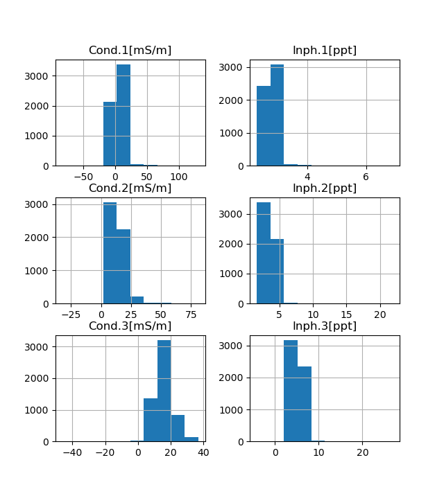  
*Fig. 2* Histogrammes initiaux pour le jeu de données exemple. On y voit de nombreux valeurs aberrantes (outliers).

Dans un premier temps, il faut donc procéder à la suppression des valeurs négatives. Ensuite, on pourra enlever les valeurs aberrantes. Pour cela, nous allons utiliser le code python [suivant](./SortingEMI.py)

```python
import numpy as np # Pour les opérations matématiques de base
import pandas as pd # Pour la gestion des données
from matplotlib import pyplot # Pour l'affichage graphique
from scipy import stats # Pour les indicateurs statistiques
# Lire le fichier de données
data = pd.read_csv('./data/exemple.dat', delimiter='\t', header=0, index_col=False)
nbInit = len(data.index)
print('Initial number of values: {}'.format(nbInit))
# Montrer les histograms initiaux:
hist = data.hist(column=['Cond.1[mS/m]','Inph.1[ppt]','Cond.2[mS/m]','Inph.2[ppt]','Cond.3[mS/m]','Inph.3[ppt]'])
pyplot.show()
# Supprimer les données non-physique (négatives) en utilisant la méthode "ge" (greater or equal) de pandas:
data = data[data[['Cond.1[mS/m]','Inph.1[ppt]','Cond.2[mS/m]','Inph.2[ppt]','Cond.3[mS/m]','Inph.3[ppt]']].ge(0).all(1)]
nbInit = len(data.index)
print('Number of physical values: {}'.format(nbInit))
# Montrer les histogrammes de chaque paramètre:
hist = data.hist(column=['Cond.1[mS/m]','Inph.1[ppt]','Cond.2[mS/m]','Inph.2[ppt]','Cond.3[mS/m]','Inph.3[ppt]'])
pyplot.show()
# On voit que les histograms ont des ranges beaucoup trop large. C'est du a la présence d'outliers.
# On peut les détecter simplement par mesure statistique (écart par rapport a la moyenne - z-score) par exemple
data = data[(np.abs(stats.zscore(data[['Cond.1[mS/m]','Inph.1[ppt]','Cond.2[mS/m]','Inph.2[ppt]','Cond.3[mS/m]','Inph.3[ppt]']]))<3).all(axis=1)]
nbInit = len(data.index)
print('Number of in-range values: {}'.format(nbInit))
# Vérifier visuellement que les données fausses soient bien enlevées:
hist = data.hist(column=['Cond.1[mS/m]','Inph.1[ppt]','Cond.2[mS/m]','Inph.2[ppt]','Cond.3[mS/m]','Inph.3[ppt]'])
pyplot.show()
# Sauver les données au format csv pour QGIS (séparateur=tabulation):
data.to_csv('./data/exemple_trier.dat', sep='\t', index=False)
```

On obtient dès lors des distributions beaucoup plus homogènes, sans outliers visibles (*Fig. 3*)

  
*Fig. 3* Histogrammes après le tri des données

### Visualisation des données:
Pour visualiser le jeu de données, nous allons utiliser [QGIS](https://www.qgis.org/fr/site/). QGIS est un logiciel SIG open-source.
Nous conseillons de choisir la version LTR (Long-term-realses) étant donné qu'elle est plus stable et qu'il n'est pas nécéssaire de disposer des fonctionnalités les plus récentes pour réaliser les exercices des travaux pratiques.

----
**Note importante**: QGIS, bien que très utile et complet est parfois instable. Pensez à sauvegarder votre progression régulièrement pour éviter de perdre tout votre travail. 
----
----

#### Installation de QGIS et des fonds de cartes:
----
Pour installer QGIS, [télécharger (https://www.qgis.org/fr/site/forusers/download.html)](https://www.qgis.org/fr/site/forusers/download.html) la version correspondante à votre OS et suivez la procédure d'installation. Une fois QGIS installé, suivez les démarches suivantes pour avoir le fond de carte de la région wallone (depuis les serveurs de WalOnMap).
- Dans l'explorateur (à gauche), clique droit sur `WMS/WMTS` &rarr; `Nouvelle connexion`
- Dans la fenêtre qui apparait, inscrire le nom et l'URL du serveur désiré.  

Voici une liste des serveurs WMS utiles:  
| Noms  | URL  |
|-------|------|
| Ortophotos 2019 Wallonie [(info)](https://geoportail.wallonie.be/catalogue/a4c49df8-8e51-4ec2-9be0-9186cb499236.html)  | https://geoservices.wallonie.be/arcgis/services/IMAGERIE/ORTHO_2019/MapServer/WMSServer?request=GetCapabilities&service=WMS |
| Carte Géologique Wallonie [(info)](https://geoportail.wallonie.be/catalogue/5bb1c85c-abe1-46b3-9af6-489ab95cd0cb.html) |  https://geoservices.wallonie.be/arcgis/services/SOL_SOUS_SOL/CARTE_GEOLOGIQUE_SIMPLE/MapServer/WMSServer?request=GetCapabilities&service=WMS |
| Fonds de carte IGN [(info)](https://www.ngi.be/website/fr/online-resources/cartoweb-be/) | https://wms.ngi.be/cartoweb/service?request=GetCapabilities&service=WMS |

Les services WMS ne seront utiles que comme fonds de carte. Aucune opération de transformations n'est possible sur ces dernières.

Un tutoriel complet pour QGIS peut être téléchargé à l'adresse suivante [https://orbi.uliege.be/handle/2268/190559](https://orbi.uliege.be/handle/2268/190559).

#### Importation des données EM dans QGIS:
----
Avant tout, créer un nouveau projet vide. Changer le système de coordonées du projet pour correspondre aux coordonnées utilisées en Belgique. Pour faire celà, aller dans `Projet` &rarr; `Propriétés...`. Dans la fenêtre qui s'ouvre, sélectionner `SCR` dans la colonne de gauche.  
Ensuite, dans filtres, rentrer `EPSG:31370`. La liste des systèmes vous présentera l'option `Belge 1972/Belgian Lambert 1972`. Sélectionner l'option puis cliquer sur `Appliquer`. Le système de projection est désormais adapté au sol belge en minimisant les distorsions. Pour d'autres pays/régions, d'autres systèmes sont plus adaptés ([https://epsg.io/](https://epsg.io/)).
Une fois le SCR défini, vous pouvez ajouter le jeu de données. 
- `Couche` &rarr; `Ajouter une couche` &rarr; `Ajouter une couche de texte délimité...`
- Dans la fenêtre qui s'affiche, sélectionner le fichier que vous souhaitez importer.
- Dans `Format du fichier`, sélectionner `délimiteur personnalisés` &rarr; `Tab`. La prévisualisation s'est mise à jour et affiche le tableau correctement.
- Dans `Définition de la géométrie`, vérifier que les champs suivant sont bien correspondant:
    - Champ X = Longitude
    - Champ Y = Latitude
    - Champ Z = Altitude
    - SCR de la géométrie: EPSG:4326 - WGS 84
- Si tous les champs sont corrects, cliquer sur `Ajouter`. Une fenêtre s'ouvre pour convertir le jeu de données en coordonnées internationales au format régional. Sélectionner `OK` pour afficher le jeu de données.

Le jeu de données est ajouté dans QGIS. Pour vérifié qu'il est bien situé sur la carte, ajouter le fond de carte `Orthophotos 2019`.

Une fois le jeu de données importé, il faut en convertir le format pour qu'il soit utilisable par QGIS. Pour faire cela, cliquer droit sur le nom de la couche de données et sélectionner `Exporter` &rarr; `Sauvegarder les entités sous...`. Dans la fenêtre qui s'ouvre, sélectionner l'emplacement de sauvegarde du nouveau fichier. Pour le champ `SCR`, sélectionner `SCR du projet: ...`. Ainsi, les données seront sauvegardées dans le bon système de coordonnées et pourront être utilisées plus aisément.

#### Analyse spatiale des données:
----
Maintenant que les données sont importées dans QGIS, on peut les analyser avec leur variation dans l'espace. Pour cela, il est nécessaire de changer l'aspect des points: 
- Clique droit sur le nom de la couche &rarr; `Propriétés` &rarr; `Symbologie`
- Choisir le style de symbologie `Gradué`
- Sélectionner la valeur pour laquelle faire l'affichage et changer la palette de couleur pour faire resortir les extrêmes. La palette `Spectral` est souvent utilisée pour la conductivité/résistivité alors que la palette `Grays` est plus fréquente pour le ratio en phase.

Sur base de ce qui est visible tel quel, il est déjà possible de définir des tendances spatiales.

#### Interpolation des points et réalisation de cartes:
----
Pour avoir une vue d'ensemble plus complète du jeu de données, il est possible de réaliser une interpolation spatiale. Pour cela, nous allons utiliser l'outil `Interpolation TIN` qui se trouve dans la boite à outils. Cette outil permet de réaliser l'interpolation de points vers une couche raster (une image) qui recouvre l'emprise complète de la couche. La procédure est la suivante:
- Dans `Boîte à outils de traitement` aller à `Interpolation` &rarr;  `Interpolation TIN`
- Dans la fenêtre qui s'ouvre, sélectionner la couche à interpoler et l'attribut. Confirmer la sélection en appuyant sur `+`.
- La méthode d'interpolation `linéaire` est suffisante dans notre cas.
- Pour l'emprise, cliquer sur `...` et sélectionner `Utiliser l'emprise de la couche...` &rarr; sélectionner le nom de la couche à interpoler.
- Dans Taille du raster résultat, il faut que le nombre de lignes/colonnes soit suffisant pour avoir une image lissée à l'échelle de visionnage.  
N.B.: Si le nombre de lignes/colonnes indique 1, c'est que le jeu de données/projet n'est pas dans le bon système de projection).
- Sélectionner ensuite le fichier dans lequel enregistrer le résultat de l'interpolation en cliquant sur `...` &rarr; `Enregistrer vers un fichier...` et placer le nouveau fichier dans votre répertoire à l'endroit approprié avec un nom précisant la nature du résultat.
- Cliquer sur `Exécuter`. Le processus d'interpolation est long. Une fois le résultat calculé, il sera affiché sur votre carte.

#### Création de cartes:
----
La dernière étape avant l'interprétation en tant que telle est la réalisation de cartes. Pour faire cela, sélectionner `Projet` &rarr; `Nouvelle mise en page`. Donner un titre à la configuration que vous allez créer. Une nouvelle fenêtre s'ouvre où vous pouvez ajouter différents éléments.

Dans la colonne de gauche, différents éléments peuvent être sélectionnés pour ajouter à la carte. Les éléments sont:
| Symbole | Action | Symbole | Action |
|:-------:|:-------|:-------:|:-------|
|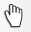|Déplacer la mise en page|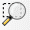|Zoomer|
|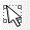|Sélectionner/Déplacer un objet|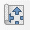|Déplacer le contenu de l'objet (carte)|
|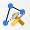|Editer les noeuds de l'objet||Ajouter une nouvelle carte|
||Ajouter une nouvelle carte 3D||Ajouter une image|
|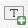|Ajouter une zone de texte||Ajouter une légende|
|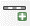|Ajouter une échelle||Ajouter une flèche indiquant le Nord|
|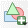|Ajouter une forme|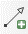|Ajouter une flèche|
|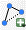|Ajouter une forme a base de noeuds|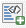|Ajouter un bloc HTML|
||Ajouter une table d'attributs| | |

Un exemple de carte est donné en *Fig. 4*. Pour la générer, il faut d'abord ajouter une carte au layout. Ensuite, nous ajoutons une légende, une flèche du nord et une échelle. Pour chaque élément ajouté, différentes options vous serons proposées dans le menu à droite de la fenêtre. La carte peut ensuite être exportée en différent formats (PNG, SVG, PDF, etc.) en allant dans `Mise en page` &rarr; `Exporter au format ...`.
  
*Fig. 4* Exemple de carte produite via QGIS

## 2) Intérprétation du jeu de données
Les cartes générées doivent être analysées. L'idée générale dans l'interprétation de données EM est de déterminer des zones d'intéret. Ces zones d'intéret sont visibles par des contrastes marquées. Ainsi, sur la carte en *Fig. 4*, on peut voir aisément trois zones se distinguant:
- Une zone de grande conductivité électrique au centre, qui semble se prolonger vers l'est
- Une zone résistive à l'ouest
- Le reste de la zone couverte avec l'EM, présentant une conductivité moyenne

Une fois les zones d'intéret déteriminées, il s'agit d'émettre des hypothèses sur l'origine des anomalies. Pour y arriver il est nécessaire de se renseigner sur le contexte global dans lequel les mesures ont été prises. Ainsi, pour le cas en *Fig. 4*, il s'agit d'une décharge publique, avec du stockage de divers déchets. Il donc semble raisonnable de penser que la zone fort conductrice caractérise une masse de déchets ménagers et métalliques. La zone intermédiare contiendrait des déchets ménagers mais avec un contenu métallique moins élevé. Finalement, la zone la plus résisitve peut correspondre à un dépot d'inertes non-métalliques. Une autre hypothèse pouvant éventuellement expliquer l'anomalie résistive serait la présence du bedrock natif de la décharge à une profondeur plus faible qu'ailleur. Cette hypothèse est renforcée par le positionnement de la zone en question à la frontière de la décharge.