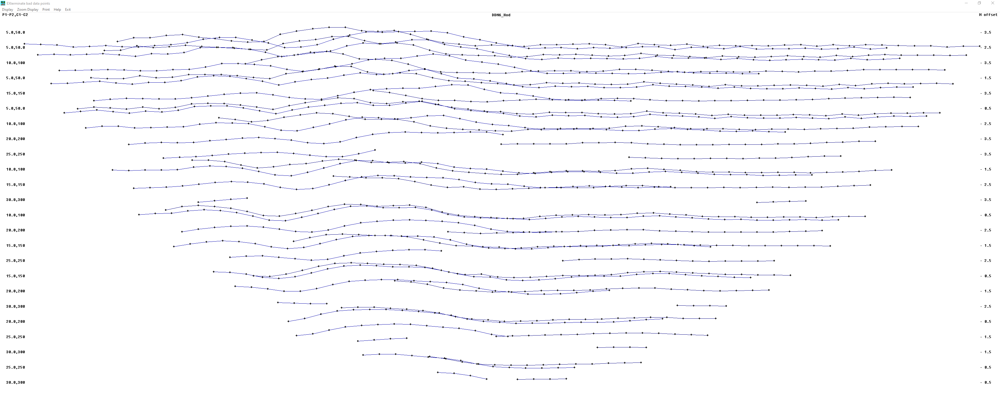
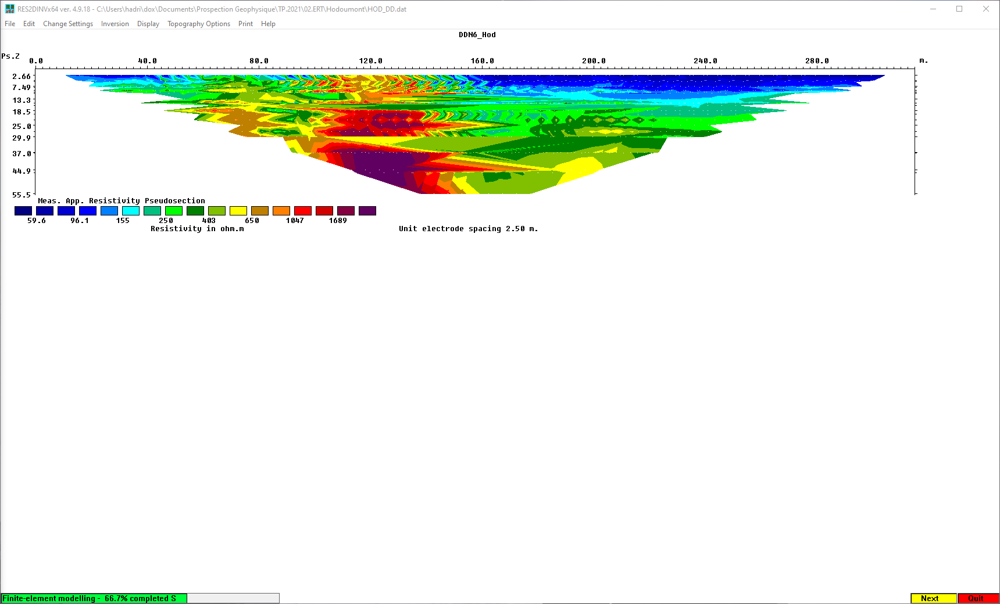
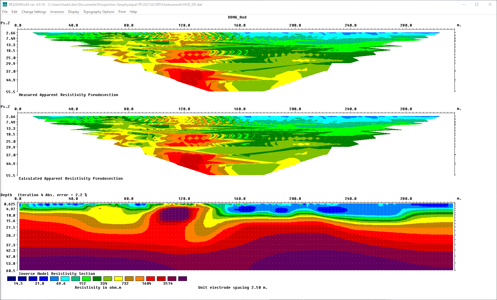
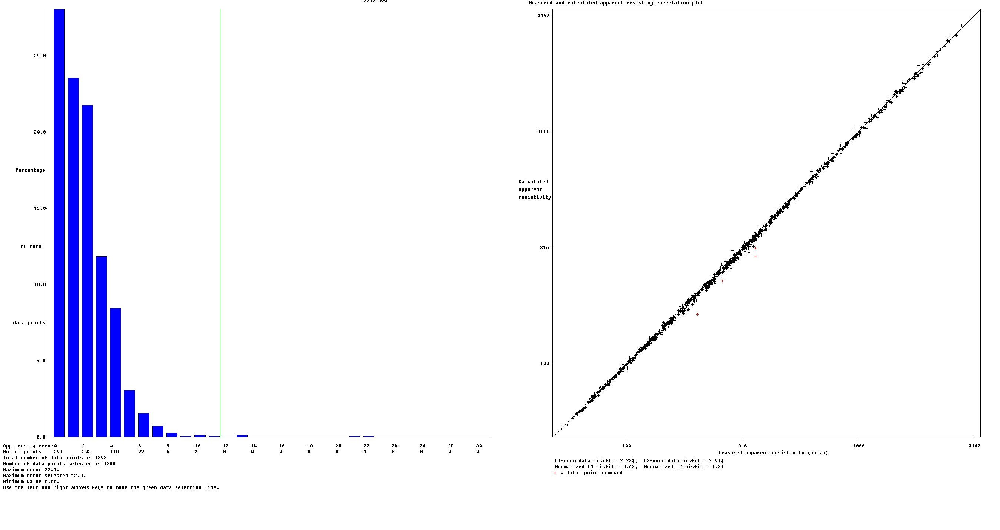
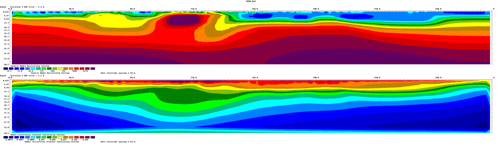
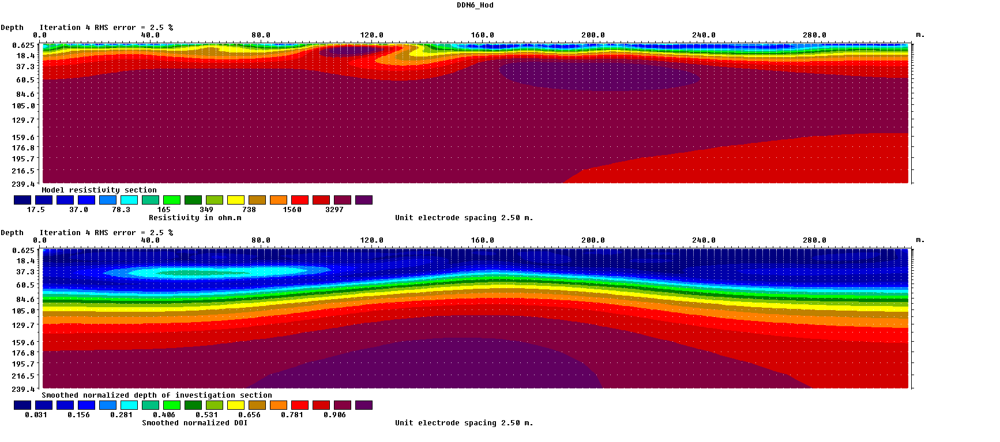

# Rappel théorique

# Aquisition de données sur le terrain

# Analyse des données

# Inversion des données
L'inversion des données est réalisée a l'aide d'un code d'inversion non linéaire. Il existe plusieurs codes permettant de faire cette tâche: RES2DINV, BERT, E4D, CRTOMO, RESIPy, etc. Dans le cadre de ces travaux pratiques, nous allons utiliser le logiciel RES2DINV. Télécharger l'archive contenant l'exécutable d'installation au lien suivant: [https://www.geotomosoft.com/Res2dinvx64_Setup.zip](https://www.geotomosoft.com/Res2dinvx64_Setup.zip). Ensuite, décompresser l'archive et installer le logiciel en suivant la procédure d'installation.

Lors du lancement de RES2DINV, une fenêtre s'affiche pour demander une clef de licence. Nous allons ici utiliser la version de démonstration de RES2DINV et n'avons donc pas besoin de license. 

RES2DINV prends en entrer un fichier de données `.dat`. Dans le cadre de ce tutoriel, nous allons utiliser le fichier [`Hod_DD.dat`](./data/HOD_DD.dat) pour faire les différentes manipulations. 

## 1) Charger les données
Avant de charger les données dans RES2DINV, nous allons définir le modèle utilisé comme étant le modèle rafiné: `Inversion` &rarr; `Model Discretization` &rarr; `Use model refinement`. Là, cocher la sélection `Use model cells with widths of half the unit space` (Utiliser des cellules de largeur égale à la moitié de l'espacement d'electrodes). Cette option permet d'obtenir un modèle plus détaillé pour l'inversion.
Pour charger les données dans RES2DINV, sélectionner `File` &rarr; `Read data file`. Une fenêtre s'ouvre et vous demande de sélectionner le fichier a inversé. 
Une fois le fichier ouvert, les caractéristiques du fichiers s'affichent dans la fenêtre principale et un message vous signale que la lecture du fichier s'est bien déroulée.

## 2) Trier les données
Pour trier les données, sélectionner `Edit` &rarr; `Exterminate bad data points`. Une nouvelle fenêtre s'ouvre (*Fig.1*). Dans cette fenêtre est affichée une version simplifiée de la pseudosection. Chaque point représente l'écart par rapport a la moyenne pour une pseudo profondeur donnée. L'idée est que, comme la géologie n'est pas chaotique, les données géophysiques ne le soient pas non plus. Il faut donc détecter les valeurs qui sortent de la tendance. Dans le cas du jeux de donné présenté en exemple, il n'y a pas de données particulièrement problématiques.

  
*Figure 1: Fenêtre de sélection des mauvais points de données*

Après avoir sélectionner les mauvais points, sélectionner `Exit` &rarr; `Quit edit window`. Si aucun point n'est enlevé, le jeux de données est conservé en mémoire tel quel. Dans le cas inverse, il est demander de sauver le fichier pour pouvoir l'utiliser dans l'inversion. Il est recommandé d'utiliser un nom explicitant clairement l'objet du fichier (par exemple, `Hod_DDN6_ExterminateBadPoints.dat`, montrant clairement l'action réalisée sur le jeu de données). Si le jeux de données est modifié, il est nécessaire de la recharger avant de procéder a la suite.

## 3) Réaliser l'inversion
Il est possible de changer beaucoup de paramètres d'inversion dans RES2DINV. Dans le cadre de cette introduction nous n'allons pas les voir. Ils sont cependant décrit complètement dans le [manuel de RES2DINV](https://www.geotomosoft.com/r2dimanu.zip).

Pour réaliser une inversion avec les paramètres par défaut, sélectionner `Inversion` &rarr; `Carry out inversion`.

Le programme va vous demander un emplacement pour suvergader les résultats de l'inversion dans un fichier `.INV`.

L'inversion va alors se lancer. Dans la fenêtre, un graphique avec la pseudosection va s'afficher en haut et la progression des calculs nécéssaire a l'inversion s'affiche en bas (*Fig.2*).

  
*Figure 2: Démarrage de l'inversion*

A la fin de l'inversion (maximum 4 itérations dans la version démo de RES2DINV), la pseudo section mesurée, la pseudo section simulée ainsi que le résultat de l'inversion sont affichées (*Fig.3*). 

  
*Figure 3: Résultats de l'inversion*

## 4) Afficher les résultats
Pour afficher les résultats détaillés, sélectionner `Display` &rarr; `Show inversion results`. 

Une nouvelle fenêtre s'ouvre. Dans cette fenêtre, vous pouvez charger un fichier d'inversion (`File` &rarr; `Read file with inversion results`), export the model for visualization in other softwares (`File` &rarr; `Model export`) ou afficher le modèle inverse (`Display sections` &rarr; `Model display`). Pour cette dernière option, il est possible de choisir les sections a afficher. Par défaut, le programme affiche la pseudo section réelle et calculée, aisni que le résultat de l'inversion pour la résistivité électrique. Si le jeu de données inversé contient égalent des données de chargeabilité, il faut choisir ce qui est montré via l'option `Model display` &rarr; `Choose resistivity or IP display`.

Avant l'affiche, il est demandé de rentrer les différents paramètres d'affichage. Les paramètres par défaut sont en général suffisant.

# Interprétation des résultats
LA première chose a regarder avant d'analyser le résultat est a quel point le résultat de l'inversion permet de reproduire les données mesurées sur le terrain. Une valeur unique est donnée pour cela: l'erreur absolue a l'itération courante (en %). De manière générale, cette erreur doit être la plus petite possible, sans cependant aller trop bas (une valeur raisonable se situe au environs de de 5%). 

Si on observe que les données ne peuvent pas être raisonablement reproduite après les 4 itérations de la version démo, il est poissible que du bruit soit toujours présent dans le jeu de donnée. Il est possible d'alors utiliser la fonctionnalité `Edit Data` &rarr; `RMS error statistics` pour analyser l'impact de données individuelles. Une nouvelle fenêtre s'ouvre (*Fig.4*) alors et il est possible de sélectionner le seuil d'erreur individuel acceptable a l'aide des flêches gauche et droite du clavier.

  
*Figure 4: Filtarge des données par RMS individuel*

Si des données sont enlevées, il faut sauvegarder le jeux de données et recommencer l'inversion. 

Une fois le fit des données assuré, il faut interprèter l'image résultant de l'inversion. Pour interprèter les données, il est bon de se remémorer les différents éléments vu lors de la partie pétrophysique du cours. Ainsi, au vu du context du profil (position, géologie, etc.) il est possible d'émètre des hypothèses sur la composition du sous-sol sur base de l'image.

## Artefacts d'inversion, sensibilité et profondeur d'investigation

Lors d'une inversion, certains éléments peuvent apparaitre dans l'image finale qui ne sont pas représentative de la réalité. Il s'agit d'artefacts d'inversions. Ces artefacts peuvent prendre plusieurs formes: object dont l'étendue est prolongé dans l'une ou l'autre direction, couche très fine résistive en surface, etc.

Il faut donc être prudent lors de l'interprétation de résultats d'inversion. Il existe néanmoins plusieurs outils permettant de déterminer si un objet visible dans le profil fait partie d'une zone sensible ou non.

Deux indices sont vu au corus de ces travaux pratiques:

### 1) Sensibilité
La matrice de sensibilité est calculée en même temps que l'inversion (il s'agit d'une matrice nécéssaire au calcul de l'inversion). On peut l'affichée en sélectionnant `Display section` &rarr; `Sensitivity displays` &rarr; `Display blocks sensitivity`. La sensibilité de l'inversion s'affiche (*Fig.5*).

  
*Figure 5: Sensibilité normalisée de l'inversion*

### 2) Profondeur d'investigation
La profondeur d'investigation peut être estimée a l'aide de l'index de profondeur d'investigation (*Depth of investigation, DOI*). Pour calculer ce dernier, il faut revenir dans l'écran d'inversion et selectionner `Inversion` &rarr; `Calculate region of investigation index`. Les paramètres par défaut qui sont proposer sont adéquat pour la majorité des cas. L'inversion dans ce cas-ci prends plus de temps et sera sauvée dans 2 fichiers `.INV` qui sont référencé dans un fichier `.txt`.

Pour afficher le DOI, il faut aller dans la fenêtre d'affichage et charger les deux fichiers du DOI: `File` &rarr; `Read DOI files` &rarr; `Read DOI pair of inversion files`. Ensuite, sélectionner `Display sections` &rarr; `Display region of investigation`. Le DOI s'affiche (*Fig. 6*).

  
*Figure 6: Profondeur d'investigation*
