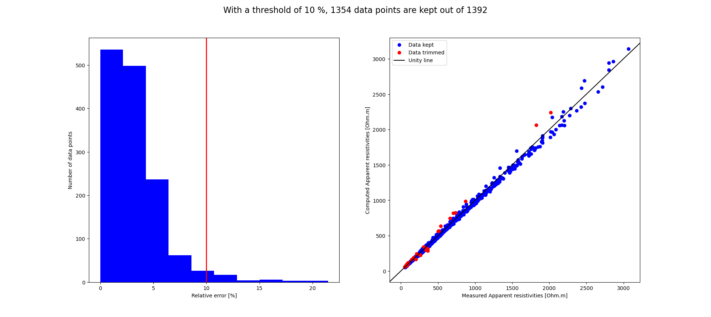

# Acquisition de données sur le terrain
Il existe de nombreux appareils permettant l'acquisition de données de résistivité électrique et/ou de chargeabilité. Au laboratoire de Géophysique appliquée de l'Université de Liège, nous possédons un [ABEM Terrameter LS (page en anglais)](https://www.guidelinegeo.com/product/abem-terrameter-ls-2/). En pratique, l'acquisition de données est relativement similaire quel que soit l'appareil.

Dans un premier temps, on enfonce les électrodes dans le sol suffisamment pour obtenir un bon contact entre l'électrode et le sol. Ces électrodes sont connectées à un cable multi-brins qui est lui-même connecté au résistivimètre. Ensuite, le résistivimètre va injecter du courant sur un jeu de deux électrodes (A et B) et mesurer le potentiel généré sur deux autres électrodes (M et N). Cette opération est répétée un grand nombre de fois afin de couvrir plusieurs positions horizontalement et verticalement. La mesure de chargeabilité se fait directement après la mesure de résistivité. En effet, après avoir chargé le sol lors de la mesure de résistivité, ce dernier va se décharger progressivement, créant un potentiel décroissant (exponentielle) sur les électrodes de mesure. Pour plus de détails, se référer au cours théorique et aux rappels.

# Analyse des données

## 1) Analyses des données brutes:
Il est de bonne pratique de réaliser des histogrammes des données pour avoir une première idée de la qualité des données ainsi que du contenu du jeu de données. Pour ce faire, nous allons charger le jeu de données comme base de données *pandas* dans python et réaliser des histogrammes de la résistance mesurée ainsi que de la chargeabilité. Le script suivant vous permet de faire cette manipulation pour un fichier `.ohm` contenant des données au format pyGIMLi (voir ci-dessous). 

```python
import pandas as pd
import numpy as np
from matplotlib import pyplot
# Importer le jeu de données via pandas:
#   Si le jeux de données contient ERT et IP et que le jeu contient des estimations d'erreur,
#   les paramètres a entrée sont ceux utilisé ci-dessous.
data = pd.read_csv('./B52_DDN6_essai.ohm', 
                   delimiter='\t', header=None, skiprows=36, 
    names= ['a','b','m','n','R (Ohm)','Res. Error (Ohm)','IP (mV/V)','IP Error (mV/V)'], index_col=False,
    skipfooter=0, engine='python')
# Si le jeux de données contient moins de données, il faut ajuster les paramètres skiprows et names en fonction.
nbInit = len(data.index)
print('Initial number of values: {}'.format(nbInit))
print(data.describe())
# Montrer les histogrammes:
# 1) Résistance: 
binsR = np.logspace(start=np.log(min(data['R (Ohm)'])), stop=np.log(np.quantile(data['R (Ohm)'],0.9)),num=20)
hist1 = data.hist(column=['R (Ohm)'], bins=binsR, density=True)
# 2) IP:
hist2 = data.hist(column=['IP (mV/V)'], density=True)
pyplot.show()
```

Sur base de l'histogramme, il est déjà possible d'anticiper le nombre et le type d'anomalies qui seront observées dans le modèle inversé.

## 2) Modèles d'erreur:
Les mesures de résistivités électriques sont accompagnées d'erreurs. Ces erreurs peuvent venir de plusieurs sources: précision de la machine, bruit électrique ambiant, etc. Une première estimation de l'erreur est réalisée automatiquement par l'ABEM lors des mesures sur le terrain. Cependant, cette erreur ne représente qu'une (faible) partie de l'erreur totale. 

La meilleure manière de calculer l'erreur attenante à une mesure est d'utiliser le théorème de réciprocité. En théorie, la résistivité mesurée lors d'une injection sur le dipôle AB et une mesure sur le dipôle MN devrait être équivalente à celle obtenue lors d'une injection sur le dipôle MN et une mesure sur le dipôle AB. Ainsi, en répétant la mesure en inversant les dipôles d'injection et de mesure, on peut obtenir une estimation de l'erreur sur la mesure. Pour plus de détails, se référer aux rappels théoriques du cours.

# Installation des logiciels
L'inversion des données est réalisée à l'aide d'un code d'inversion non linéaire. Il existe plusieurs codes permettant de réaliser cette tâche: RES2DINV, BERT, E4D, CRTOMO, RESIPy, etc. Dans le cadre de ces travaux pratiques, nous allons utiliser les librairies open-source [pyGIMLI](https://www.pygimli.org/) et [pyBERT](https://gitlab.com/resistivity-net/bert). Téléchargez l'archive contenant l'exécutable d'installation "Installation ERT" sur Teams. Ensuite, décompressez l'archive.

Pour l'installation de l'environnement contenant pyGIMLI et pyBERT, il vous faudra utiliser anaconda. Ouvrez l'invite de commande anaconda (`Anaconda prompt`) et tapez les instructions suivantes (attention que le fichier (`ERT.yml`) doit bien se trouver dans le fichier courant):
```
cd "C:/my-directory"
conda env create -f ERTIP.yml
conda activate pg
python RIPpy.py
```
# Inversion des données 
L'environnement nouvellement créé utilise donc les librairies [pyGIMLI](https://www.pygimli.org/) et [pyBERT](https://gitlab.com/resistivity-net/bert). Une interface graphique vous permet une utilisation optimale sans forcément maîtriser le langage python.  

L'interface `ERT-IP inversion` prend en entrée un fichier de données `.ohm`. Dans le cadre de ce tutoriel, nous allons utiliser le fichier [`Hod_DD.ohm`](./data/Hod_DD.ohm) à titre d'exemple pour réaliser les différentes manipulations. 

## 1) Charger les données

Pour charger les données dans L'interface `ERT-IP inversion`, sélectionner `File` &rarr; `Load data`. Une fenêtre s'ouvre et vous demande de sélectionner le fichier à inverser. 
Une fois le fichier ouvert, les caractéristiques du fichier s'affichent dans la fenêtre principale (ainsi que dans l'invite de commande d'anaconda) et un message vous signale que la lecture du fichier s'est bien déroulée.

## 2) Réaliser l'inversion

Il est possible de contrôler et modifier beaucoup de paramètres d'inversion grâce à pygimli. Dans le cadre de cette introduction nous n'allons pas les voir. Ils sont cependant décrits complètement dans l'[API de pyGIMLi](https://www.pygimli.org/gimliapi/classGIMLI_1_1RInversion.html#a64e77df1cc633bbc711e2167401834a3).

Si vous souhaitez observer la pseudosection pour faire une première analyse sur les données avant de lancer une inversion, ceci est possible en sélectionnant `File` &rarr; `Show pseudosection matrix`

Pour réaliser une inversion avec les paramètres par défaut, sélectionner `Inversion` &rarr; `Run inversion`. L'inversion va alors automatiquement se lancer. Il est possible de suivre sa progression dans l'invite de commande d'anaconda. En plus du nombre d'itérations ou du RMS, il est possible d'observer l'évolution de plusieurs facteurs tel que le chi<sup>2</sup> (*Fig.3*). 

  
*Figure 3: Evolution des paramètres d'évaluation de l'inversion*

A la fin de l'inversion le résultat de celle-ci, c'est-à-dire la distribution de la résistivité calculée au sein du modèle, est affiché (*Fig.4*). 


  
*Figure 4: Résultat de l'inversion*

## 3) Afficher les résultats

Pour afficher les résultats détaillés, sélectionner `Post-inversion` &rarr; `Display results`.

Une nouvelle fenêtre s'ouvre. Dans cette fenêtre tous les modèles disponibles à l'affichage sont proposés. Les modèles grisés indiquent que ces données ne sont pas disponibles. Par exemple, dans le cas qui nous occupe seul les modèles des valeurs de résistivité et la sensibilité sont affichables (*Fig.5*). Les modèles disponibles sont : résistivité, chargeabilité, chargeabilité normalisée, sensibilité et DOI normalisé. Vous pourrez choisir l'échelle de couleur ,`Colormap` et fixer la taille de cette échelle avec les valeurs minimum et maximum. La possibilité de choisir une échelle logarithmique vous est aussi offerte.Vous pourrez aussi jouer avec le titre des axes et leur police. Attention, même si certains modèles ne sont pas affichables, veillez à quand même leur entrer des valeurs min et max, sinon cela entraînera un erreur dans l'exécution du code. Une autre possibilité pour afficher les résultats est de les exporter sous le format `.vtk` et d'ensuite les visualiser à l'aide d'un logiciel de visualisation (cf. Visualisation des données (PARAVIEW)). Celui est possible en cliquant sur `File` &rarr; `Export results as VTK file`. 

  
*Figure 5: Fenêtre de choix des modèles à afficher*

## Interprétation des résultats
La première chose à regarder avant d'analyser le résultat est à quel point le résultat de l'inversion permet de reproduire les données mesurées sur le terrain. Une valeur unique est donnée pour cela: l'erreur absolue à l'itération courante (en %). De manière générale, cette erreur doit être la plus petite possible, sans cependant aller trop bas (une valeur raisonable se situe aux environs de 5%). 

Si on observe que les données ne peuvent pas être raisonnablement reproduites après les 4 itérations de la version démo, il est possible que du bruit soit toujours présent dans le jeu de données. Il est possible d'alors utiliser la fonctionnalité `Post-inversion` &rarr; `Trim data` &rarr; `Apparent resistivity` (ou `Apparent chargeability` si ce sont les données de chargeabilité qui vous intéressent) pour analyser l'impact de données individuelles. Une nouvelle fenêtre s'ouvre (*Fig.6*), et il est possible de sélectionner le seuil d'erreur individuel acceptable à l'aide des flèches gauche et droite du clavier.

  
*Figure 6: Filtrage des données par RMS individuel*

Si des données sont enlevées, il faut sauvegarder le jeu de données dans un nouveau fichier et recommencer l'inversion. 

Une fois le fit des données assuré, il faut interpréter l'image résultante de l'inversion. Pour interpréter les données, il est bon de se remémorer les différents éléments vus lors de la partie pétrophysique du cours. Ainsi, au vu du contexte du profil (position, géologie, etc.) il est possible d'émettre des hypothèses sur la composition du sous-sol sur base de l'image.

## Artefacts d'inversion, sensibilité et profondeur d'investigation

Lors d'une inversion, certains éléments peuvent apparaître dans l'image finale mais ne pas être représentatifs de la réalité. Il s'agit d'artefacts d'inversions. Ces artefacts peuvent prendre plusieurs formes: objets dont l'étendue est prolongée dans l'une ou l'autre direction, couche très fine résistive en surface, etc.

Il faut donc être prudent lors de l'interprétation de résultats d'inversion. Il existe néanmoins plusieurs outils permettant de déterminer si un objet visible dans le profil fait partie d'une zone sensible ou non.

Deux de ces outils sont vus au cours de ces travaux pratiques:

### 1) Sensibilité

La matrice de sensibilité est calculée en même temps que l'inversion (il s'agit d'une matrice nécessaire au calcul de l'inversion). On peut l'afficher en sélectionnant `Post-inversion` &rarr; `Display results` &rarr; `Show coverage model`. La sensibilité de l'inversion s'affiche (*Fig.6*). Il convient d’interpréter précautionneusement les parties du modèle présentant des valeurs de sensibilité faibles ce qui se traduit par un impact faible des paramètres du modèle sur les données simulées. Un désavantage de cet outil est le choix subjectif de la valeur limite, sous laquelle les parties du modèle ne sont plus considérées suffisamment représentatives. Un choix possible est de fixer ce seuil où le gradient le plus fort de la sensibilité est observé. 

  
*Figure 5: Modèle de sensibilité de l'inversion*

### 2) Profondeur d'investigation

La profondeur d'investigation peut être estimée à l'aide de l'index de profondeur d'investigation (*Depth of investigation, DOI*). Pour calculer ce dernier, il faut relancer une inversion puis calculer le DOI dans `Inversion` &rarr; `Calculate DOI`. 

Une fois celui-ci calculé, pour l'afficher il faut aller dans la fenêtre d'affichage et sélectionner `Show normalized DOI model `

# Visualisation des données (PARAVIEW)
Pour visualiser des résultats d'inversion plus complexes, nous allons utiliser un logiciel de visualisation 3D appelé [Paraview](https://www.paraview.org/). Ce logiciel permet de simplement visualiser un bloc modèle 3D et de réaliser des manipulations de base dessus.

Les fichiers représentant les modèles d'inversions sont donnés sous le format `.vtk`. Ces fichiers contiennent la géométrie ainsi que les valeurs obtenues pour le modèle inverse. Il est donc possible d'analyser le "mesh" d'inversion en même temps que le résultat.

Dans un premier temps, nous allons charger un modèle dans la fenêtre de Paraview. Pour ce faire, il suffit de glisser le fichier `.vtk` dans la zone `Pipline Browser`. Une fois le fichier chargé, les propriétés de l'objet vont s'afficher en dessous dans le volet `Properties`. Cliquer sur `Apply` pour afficher le modèle.

Pour manipuler l'objet, il suffit de cliquer sur la fenêtre et de faire tourner le mesh. Il peut cependant parfois être difficile d'avoir une orientation spécifique. Pour cela, différentes options sont présentes dans la barre d'outils `Camera Controls` (voir *Fig. 7*).

  
*Figure 7: Import dans paraview et mouvements*

Il est possible de changer le type de données visualisé (Inversion en résistivité, IP ou sensibilité par exemple). Pour faire cela, il faut utiliser la boîte à outils `Active Variable Controls`. Une fois une donnée sélectionnée, il est possible de changer l'échelle de visualisation qui lui est appliquée. Un exemple est montré en Figure 8 
Dans le volet de droite, il est possible de changer l'échelle de couleurs (*Fig. 8*).

  
*Figure 8: Changer l'échelle de couleur dans paraview*

Ensuite, il est possible de faire des manipulations plus avancées de type "Clip", "Slice" et "Threshold". Ces manipulations vont permettre d'observer l'intérieur du modèle.

  
*Figure 9: Clip et Threshold dans paraview*

# A vous de jouer!