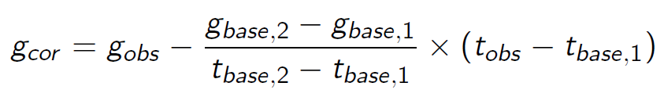

# Acquisition de données sur le terrain

Il existe de nombreux appareils permettant l'acquisition de données de gravimétrie. A l'heure actuelle, les instruments terrestres portables modernes comprennent des systèmes automatisés de nivellement et d'enregistrement de données mais leurs capteurs sont toujours essentiellement basés sur les variations d'une masse au bout d'un ressort qui découlent d'une modification de l'accélération gravitationnelle. Parfois les changements de longueur du ressort sont tellement faibles qu'ils nécessitent une certaine forme d'amplification. Les anomalies mesurées sont généralement entre 0.1 et 0.00001 Gal et s'expriment donc le plus souvent en mGal. Pour rappel 1 Gal équivaut à 1 cm/s<sup>2</sup>.

# Installation

Pour ces travaux pratiques, c'est Excel qui sera utilisé dans un premier temps. Ensuite, il faudra passer à python où la librairie utilisée sera [pyGIMLI](https://www.pygimli.org/). Le même environnement que pour le TP ERT/IP peut être utilisé. Veuillez donc vous référer à l'installation [ERT-IP](../ERT_IP/README_ERTIP.md). Il vous faudra peut-être réinstaller une interface dans l'environnement. Pour ce faire il suffit de taper dans votre invite de commande anaconda (`Anaconda prompt`)
```
conda install spyder
```

# Les corrections

Le premier traitement de données à appliquer aux données de gravimétrie est l'élimination des effets connus causés par des caractéristiques prévisibles qui ne font pas partie de la cible et influencent fortement les données brutes. Une fois toutes les corrections utiles appliquées et la suppression de tous les effets connus, l'anomalie restante est alors interprétée en termes de variations de densité sous la surface. Une réflexion préalable est nécessaire pour comprendre si ces corrections impliquent une addition ou une soustraction de l'anomalie.

## L'effet des marées terrestres

Les marées terrestres ont un impact sur les mesures gravimétriques. Comme cet impact est connu et mesurable, la correction peut aisément être trouvée en ligne.

## La dérive

La fatigue mécanique ou la température par exemple peuvent avoir un impact sur la mesure au fil du temps.Pour prendre en compte cette dérive, la mesure est répétée à différents moments sur la même station (de base) afin de mesurer la dérive. La formule à appliquer est la suivante:



Pour ne pas devoir toujours retourner à la station de base, qui peut parfois se trouver à une distance considérable, les mesures peuvent être répétées à des stations intermédiaires.

## La latitude

La gravité est plus forte aux pôles qu'à l'équateur et ce même s'ils sont plus proches du centre de la Terre. Ceci est dû à la force centrifuge opposée à l'équateur. La gravité augmente donc plus vous vous déplacez au nord de votre station de référence. La correction à appliquer est de 0.0081 sin(2a) mGal/10 m (où est la latitude).

## L'air libre

Cette correction s'intéresse à l'élévation et permet la prise en compte de la dépendance à 1/r<sup>2</sup>. Une correction approximative à appliquer est de 0.3086 mGal/m.


## La correction de Bouguer

Cette correction corrige la valeur de la correction de l'air libre pour prendre en compte la masse de matériau entre l'élévation de référence et celle de la mesure. La correction à appliquer est 0.04191 * 10<sup>-3</sup> $\rho$  mGal/m, où $\rho$ est en première approximation évaluée à 2670 kg/m<sup>3</sup> (densité du quartz) ou par échantillonnage.

## La topographie

Cette correction tient compte de la masse supplémentaire au-dessus (ex: collines), ou du déficit de masse (ex: vallées) en-dessous de l'altitude d'une mesure.

# La modélisation directe

## L'anomalie dans un milieu homogène

Les modèles directs permettent de simuler la réponse gravimétrique en fonction de différentes hypothèses sur la géologie, la topographie et les propriétés physiques de la Terre. Cela permet aux géophysiciens de mieux comprendre les anomalies gravimétriques mesurées et de déterminer la position et la profondeur des structures géologiques sous-jacentes. La réalisation d'un modèle direct avant une campagne de terrain permet donc de mieux comprendre les anomalies rencontrées mais aussi d'optimiser la collecte de données. Le modèle direct le plus simple est celui d'une anomalie cylindrique perpendiculaire à un profil, dans un milieu homogène.

La librairie [pyGIMLI](https://www.pygimli.org/) offre déjà un exemple permettant la simulation de résultats obtenus à partir de ce type de modèle à l'aide du code :

```python
import numpy as np
import pygimli as pg
from pygimli.meshtools import createCircle, createWorld, createMesh, createRectangle , createGrid
import matplotlib.pyplot as plt

from pygimli.physics.gravimetry import gradUCylinderHoriz, solveGravimetry

radius = 2.  # [m]
depth = 5.  # [m]
pos = [0., -depth]
dRho = 100

x = np.arange(-20, 20.1, .5)
pnts = np.array([x, np.zeros(len(x))]).T

###############################################################################
# Analytical solution first
gz_a = gradUCylinderHoriz(pnts, radius, dRho, pos)[:, 1]

###############################################################################
# Integration for a 2D polygon after :cite:`WonBev1987`
circ = createCircle([0, -depth], radius=radius, marker=2, area=0.1,
                	nSegments=16)
gz_p = solveGravimetry(circ, dRho, pnts, complete=False)

###############################################################################
# Integration for complete 2D mesh after :cite:`WonBev1987`
world = createWorld(start=[-20, 0], end=[20, -10], marker=1)
mesh = createMesh([world, circ])
dRhoC = pg.solver.parseMapToCellArray([[1, 0.0], [2, dRho]], mesh)
z=min(dRhoC)
gc_m = solveGravimetry(mesh, dRhoC, pnts)

plc = world + circ

###############################################################################
# Finishing the plots
fig = plt.figure()

ax1 = pg.plt.subplot(2, 1, 1)
ax1.plot(x, gz_a, '-b', marker='.', label='Analytical')
ax1.plot(x, gz_p, label='Integration: Polygon ')
ax1.plot(x, gc_m, label='Integration: Mesh')
# ax1.plot(x, dudz, label=r'FEM: $\frac{\partial u}{\partial z}$')
ax2 = pg.plt.subplot(2, 1, 2)
pg.show(plc, ax=ax2)
ax2.plot(x, x*0,  'bv')

ax1.set_ylabel(r'$\frac{\partial u}{\partial z}$ [mGal]')
ax1.set_xlabel('$x$-coordinate [m]')
ax1.grid()
ax1.legend()


ax2.set_aspect(1)
ax2.set_xlabel('$x$-coordinate [m]')
ax2.set_ylabel('$z$-coordinate [m]')
ax2.set_ylim((-10, 0))
ax2.set_xlim((-20, 20))
```


Il est intéressant de s'attarder sur les différents types de résolutions de la solution pour le potentiel gravimétrique. Il est aussi important de modifier différents paramètres tels que la taille ou la profondeur de l'anomalie et la différence de densité entre l'anomalie et le milieu afin de comprendre leur impact.

## La maillage et le principe de superposition  

Pour représenter une sous-sol plus complexe, il est possible d'utiliser le principe de superposition et donc d'additionner les potentiels. Vous pouvez imaginer votre sous-sol comme un ensemble de carrés dont la position est fixée. Connaissant l'anomalie liée à un carré seul, il suffit de faire la somme des anomalies pour obtenir l'anomalie totale. C'est donc une discrétisation géométrique du système pour lequel nous sommes capables de calculer de manière analytique la solution individuelle de chaque anomalie. Le code suivant nous permet de réaliser cette discrétisation via un maillage carré.
```python
import numpy as np
import pygimli as pg
from pygimli.meshtools import   createGrid
import matplotlib.pyplot as plt

from pygimli.physics.gravimetry import  solveGravimetry
# Measurements points
x = np.arange(-20, 20.1, .5)
pnts = np.array([x, np.zeros(len(x))]).T

# Meshing
x2 = np.arange(-20, 20.1, 1)
y2 = np.arange(0, -10.1, -2)
Grid = createGrid(x2,y2,marker=1)

# delta rho distribution
dRhoRec = pg.solver.parseMapToCellArray([[1, 0.0]], Grid)
dRhoRec[60]=100
dRhoRec[61]=100
gc_rec = -solveGravimetry(Grid, dRhoRec, pnts)

###############################################################################
# Finishing the plots
fig = plt.figure()
ax1 = pg.plt.subplot(2, 1, 1)
ax1.plot(x, gc_rec, label='Grid')
ax2 = pg.plt.subplot(2, 1, 2)
ax2.plot(x, x*0,  'bv')
pg.show(Grid, dRhoRec, ax=ax2)
pg.wait()

ax1.set_ylabel(r'$\frac{\partial u}{\partial z}$ [mGal]')
ax1.set_xlabel('$x$-coordinate [m]')
ax1.grid()
ax1.legend()

ax2.set_aspect(1)
ax2.set_xlabel('$x$-coordinate [m]')
ax2.set_ylabel('$z$-coordinate [m]')
ax2.set_ylim((-10, 0))
ax2.set_xlim((-20, 20))
```
Dans un premier temps, deux anomalies proches sont placées dans un milieu homogène. Pour comprendre la solution obtenue et l'utilisation du principe de superposition, il semble opportun de modifier ces anomalies, tant en termes de position, qu'en termes de différence de masse volumique, qu'en nombre d'anomalies totales ou encore en termes de raffinement du maillage.

# L'inversion (linéaire)

L'inversion est une approche mathématique utilisée pour extraire des informations détaillées sur la structure interne de la Terre à partir de mesures géophysiques. Elle implique la résolution d'un problème inverse, où les données observées sont utilisées pour estimer les propriétés physiques du sous-sol. Que ce soit en gravimétrie ou dans d'autres domaines, l'inversion permet de reconstruire des modèles souterrains en ajustant de manière itérative les paramètres du modèle afin de minimiser les écarts entre les données mesurées et les prédictions du modèle. Bien que la linéarité ou non du problème fait varier les détails des méthodes itératives, le processus fondamental d'ajustement itératif des paramètres pour minimiser la fonction coût (écart entre observations et prédictions du modèle) reste une caractéristique commune aux différents types d'inversion.

## Le facteur de régularisation 

Dans un premier temps, l'inversion consiste en une solution des moindres carrées et vise à minimiser l'écart entre les données mesurées et les données calculées du modèle. Malheureusement, le problème inverse est généralement mal posé ou mal conditionné ce qui peut provoquer l'apparition d'artéfacts. Il convient donc d'introduire un facteur de régularisation. Le facteur de régularisation introduit une contrainte qui guide l'inversion en favorisant des solutions plus lisses, ce qui peut aider à prévenir des ajustements excessifs aux bruits dans les données. En d'autres termes, la régularisation vise à éviter des solutions qui pourraient être trop sensibles aux variations locales des données, en introduisant une certaine préférence pour des modèles plus simples ou plus réguliers. Le choix du facteur de régularisation est souvent un compromis délicat entre l'ajustement précis aux données et la stabilité de la solution.

## La contrainte de pondération en fonction de la profondeur 

Si on s'intéresse aux résultats de la résolution du problème inverse, il est visible que la majorité des solutions présentent des variations de la masse volumique en surface. Ce phénomène est lié au fait que la méthode de la gravimétrie n'a en réalité aucune résolution en profondeur. Afin de générer une sensibilité artificielle en profondeur, il convient de rajouter un terme de contrainte de pondération en fonction de la profondeur. Cette approche vise à accorder une importance différente aux données en fonction de leur profondeur respective pendant le processus d'inversion. L'idée sous-jacente est que les données provenant de certaines profondeurs peuvent être plus fiables ou moins sujettes à des influences indésirables que d'autres. Par conséquent, la pondération des données peut être ajustée pour refléter cette variation de fiabilité en fonction de la profondeur. Cette approche nécessite généralement une connaissance préalable (forage) ou une estimation de la fiabilité relative des données à différentes profondeurs. L'application judicieuse de contraintes de pondération en fonction de la profondeur peut contribuer à obtenir des modèles plus précis et plus fiables en tenant compte de la variabilité des données géophysiques à différentes profondeurs.

Le code suivant est un exemple venant directement de la libraire [pyGIMLI](https://www.pygimli.org/_examples_auto/4_gravimetry_magnetics/plot_03_inv-gravity-2d.html#sphx-glr-examples-auto-4-gravimetry-magnetics-plot-03-inv-gravity-2d-py):

```python

import numpy as np
import pygimli as pg
import pygimli.meshtools as mt
# from pygimli.viewer import pv
from pygimli.physics.gravimetry import GravityModelling2D

# %%
# Synthetic model and data generation
# -----------------------------------
# We create a rectangular modelling domain (50x15m) with a flat anomaly  
# in a depth of about 5m.
#

world = mt.createWorld(start=[-25, 0], end=[25, -15],
                       marker=1)
rect = mt.createRectangle(start=[-6, -3.5], end=[6, -6.0],
                          marker=2, area=0.1)
rect.rotate([0, 0, 0.15])

geom = world + rect
#pg.show(geom, markers=True)
mesh = mt.createMesh(geom, quality=33, area=0.2)

# %%%
# We assume measuring the gravity on a 50m long profile with dense spacing.
# We initialize the forward response by passing mesh and measuring points.
# Additionally, we map a density to the cell markers to build a model vector.
#

x = np.arange(-25, 25.1, .5)
pnts = np.array([x, np.zeros(len(x))]).T

fop = GravityModelling2D(mesh=mesh, points=pnts)
dRho = pg.solver.parseMapToCellArray([[1, 0.0], [2, 300]], mesh)
g = fop.response(dRho)

# %%%
# We define an absolute error and add some Gaussian noise.
#

error = 0.0005
data = g + np.random.randn(len(g)) * error

# %%%
# The model response is then plotted along with the model
#

fig, ax = pg.plt.subplots(ncols=1, nrows=2, sharex=True)
ax[0].plot(x, data, "+", label="data")
ax[0].plot(x, g, "-", label="noisefree")
ax[0].set_ylabel(r'$\frac{\partial u}{\partial z}$ [mGal]')
ax[0].grid()
ax[0].legend()

pg.show(mesh, dRho, ax=ax[1])
ax[1].plot(x, x*0, 'bv')
ax[1].set_xlabel('$x$-coordinate [m]')
ax[1].set_ylabel('$z$-coordinate [m]')
ax[1].set_ylim((-9, 1))
ax[1].set_xlim((-25, 25))
fig.tight_layout()


# %%%
# For inversion, we create a new mesh from the rectangular domain and setup a
# new instance of the modelling operator.
#

mesh = mt.createMesh(world, quality=33, area=1)
fop = GravityModelling2D(mesh=mesh, points=pnts)

# %%%
# Depth weighting
# ---------------
#
# In the paper of Li & Oldenburg (1996), they propose a depth weighting of the
# constraints with the formula

cz = -pg.y(mesh.cellCenters())
Beta = 3 
z0 = 5
wz = 1 / (cz+z0)**(Beta/2)

fig, ax = pg.plt.subplots()
ax.plot(cz, wz, ".")
ax.set_ylabel('Z (cell centroid)')
ax.set_xlabel('Weight [-]')

# %%%
# Inversion
# ---------
#
# For inversion, we use geostatistic regularization with a higher correlation
# length for x, compared to y, to account for the large equivalence.
# We limit the model to reasonable density contrasts of +/- 1000 kg/m^3.
# As the depth weighting decreases the local regularization weights, we have
# to increase the overall regularization strength lambda.
#

fop.region(1).setConstraintType(2)
inv = pg.Inversion(fop=fop)
inv.setRegularization(limits=[-1000, 1000], trans="Cot",
                      correlationLengths=[12, 2])
inv.setConstraintWeights(wz)
rho = inv.run(g, absoluteError=error, lam=10e5, verbose=True)

# %%%
# Visualization
# -------------
#
# For showing the model, we again plot model response and model.
#

fig, ax = pg.plt.subplots(ncols=1, nrows=2, sharex=True)
ax[0].plot(x, data, "+", label='data')
ax[0].plot(x, inv.response, "-", label='noisefree')
ax[0].set_ylabel(r'$\frac{\partial u}{\partial z}$ [mGal]')
ax[0].grid()
ax[0].legend()

pg.show(mesh, rho, ax=ax[1], logScale=False)
pg.viewer.mpl.drawPLC(ax[1], rect, fillRegion=False)
ax[1].plot(x, x*0, 'bv')
ax[1].set_xlabel('$x$-coordinate [m]')
ax[1].set_ylabel('$z$-coordinate [m]')
ax[1].set_ylim((-12, 1))
ax[1].set_xlim((-25, 25))
fig.tight_layout()


```

Il convient de réaliser une première inversion sans facteur de régularisation (lambda) et sans pondération en fonction de la profondeur (wz). Ensuite, veuillez analyser l'impact de l'introduction de ces deux termes sur le résultat de l'inversion. Analysez l'impact des variations de la valeur du lambda. Faites de même avec le terme Beta et son impact sur la fonction de la sensibilité par rapport à la profondeur. 

