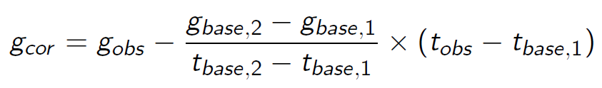

# Aquisition de données sur le terrain

Il existe de nombreux appareils permettant l'aquisition de données de gravimétrie. A l'heure actuelle, les instruments terrestres portables modernes comprennent des systèmes automatisés de nivellement et d'enregistrement de données mais leurs capteurs sont toujours essentiellement basés sur les variations d'une masse au bout un ressort qui découlent d'une modification de l'accélération gravitationnelle. Parfois les changements de la longueur du ressort sont tellement faibles qu'ils nécessitent une certaine forme d'amplification. les anomalies mesurées sont généralement entre 0.1 et 0.00001 Gal et s'expriment donc le plus souvent en mGal. Pour rappel 1 Gal équivaut à 1 cm/s<sup>2</sup>.

# Installation 

Pour ces travaux pratiques, c'est Excel qui sera utilisé dans un premier temps. Ensuite, il faudra passer à python où la librairie utilisée sera [pyGIMLI](https://www.pygimli.org/). Le même environnement que pour le TP ERT/IP peux être utilisé. Veuillez donc vous référer à l'installation [ERT-IP](../ERT_IP/README_ERTIP.md). Il vous faudra peut-être réinstaller une interface dans l'environnement. Pour ce faire il suffit de taper dans votre invite de commande anaconda (`Anaconda prompt`)
```
conda install spyder
```


# Les corrections

Le premier traitement de données à appliquer aux données de gravimétrie est l'éliminations des effets connus causés par des caractéristiques prévisibles qui ne font pas partie de la cible et influencent fortement les données brutes. Une fois toutes les corrections utiles appliquées et la suppression de tous les effets connus, l'anomalie restante est alors interprétée en termes de variations de densité sous la surface. Une réflexion préalable est nécessaire pour comprendre si ces corrections impliquent une addition ou une soustraction de l'anomalie. 

## La latitude

La gravité est plus forte aux pôles qu'à l'équateur et ce même s'ils sont plus proches du centre de la Terre. Ceci est dû à la force centrifuge opposée à l'équateur. La gravité augmente donc plus vous vous déplacez au nord de votre station de référence. La correction à appliquer est de 0.0081 sin(2a) mGal/10m (où a est la latitude)

## L'air libre 

Cette correction s'intéresse à l'élévation et permet la prise en compte de la dépendence à 1/r<sup>2</sup>. Une correction approximative à appliquer est de 0.03086 mGal/m.

## La correction de Bouguer

Cette correction corrige la valeur de la correction de l'air libre pour prendre en compte la masse de matériau entre l'élévation de référence et celle de la mesure. La correction à appliquer est 0.04191 * 10<sup>-3</sup> $\rho$  mGal/m, où $\rho$ est en première approximation évaluée à 2670 kg/m<sup>3</sup> (densité du quartz) ou par échantillonage.

## La topographie

Cette correction tient compte de la masse supplémentaire au-dessus (ex: collines), ou du déficit de masse (ex: vallées) en-dessous de l'altitude d'une mesure.

## L'effet des marées terrestres

Pour prendre en compte l'effet des marées, la mesure est répétée à différents moments sur la même station (de base) afin de mesurer la dérive. La formule à appliquer est la suivante:




# La modélisation directe

## L'anomalie dans un milieu homogène 

Les modèles directs permettent de simuler la réponse gravimétrique en fonction de différentes hypothèses sur la géologie, la topographie et les propriétés physiques de la Terre. Cela permet aux géophysiciens de mieux comprendre les anomalies gravimétriques mesurées et de déterminer la position et la profondeur des structures géologiques sous-jacentes. La réalisation d'Un modèle direct avant une campagne de terrain permet donc de mieux comprendre les anomalies rencontrées mais aussi d'optimiser la collecte de données. Le modèle direct le plus simple est celui d'une anomalie cylindrique perpendiculaire à un profil, dans un milieu homogène. 

La librairie [pyGIMLI](https://www.pygimli.org/) offre déjà un exemple permettant la simulation de résulats obtenus à partir de ce type de modèle à l'aide du code :

```python
import numpy as np
import pygimli as pg
from pygimli.meshtools import createCircle, createWorld, createMesh, createRectangle , createGrid
import matplotlib.pyplot as plt

from pygimli.physics.gravimetry import gradUCylinderHoriz, solveGravimetry

radius = 2.  # [m]
depth = 5.  # [m]
pos = [0., -depth]
dRho = 100

x = np.arange(-20, 20.1, .5)
pnts = np.array([x, np.zeros(len(x))]).T

###############################################################################
# Analytical solution first
gz_a = gradUCylinderHoriz(pnts, radius, dRho, pos)[:, 1]

###############################################################################
# Integration for a 2D polygon after :cite:`WonBev1987`
circ = createCircle([0, -depth], radius=radius, marker=2, area=0.1,
                    nSegments=16)
gz_p = solveGravimetry(circ, dRho, pnts, complete=False)

###############################################################################
# Integration for complete 2D mesh after :cite:`WonBev1987`
world = createWorld(start=[-20, 0], end=[20, -10], marker=1)
mesh = createMesh([world, circ])
dRhoC = pg.solver.parseMapToCellArray([[1, 0.0], [2, dRho]], mesh)
z=min(dRhoC)
gc_m = solveGravimetry(mesh, dRhoC, pnts)

plc = world + circ

###############################################################################
# Finishing the plots
fig = plt.figure()

ax1 = pg.plt.subplot(2, 1, 1)
ax1.plot(x, gz_a, '-b', marker='.', label='Analytical')
ax1.plot(x, gz_p, label='Integration: Polygon ')
ax1.plot(x, gc_m, label='Integration: Mesh')
# ax1.plot(x, dudz, label=r'FEM: $\frac{\partial u}{\partial z}$')
ax2 = pg.plt.subplot(2, 1, 2)
pg.show(plc, ax=ax2)
ax2.plot(x, x*0,  'bv')

ax1.set_ylabel(r'$\frac{\partial u}{\partial z}$ [mGal]')
ax1.set_xlabel('$x$-coordinate [m]')
ax1.grid()
ax1.legend()


ax2.set_aspect(1)
ax2.set_xlabel('$x$-coordinate [m]')
ax2.set_ylabel('$z$-coordinate [m]')
ax2.set_ylim((-10, 0))
ax2.set_xlim((-20, 20))
```


Il est intéressant de s'attarder sur les différents types de résolutions de la solution pour le potentiel gravimétrique. Il est aussi important de modifier différents paramètres tels que la taille ou la profondeur de l'anomalie et la différence de densité entre l'anomalie et le milieu afin de comprendre leur impact. 

## La maillage et le principe de superposition  

Pour représenter une sous-sol plus complexe, il est possible d'utiliser le principe de superposition et donc d'additionner les potentiels. Vous pouvez imaginer votre sous-sol comme un ensemble de carrés dont la position est fixée. Connaissant l'anomalie liée à un carré seul, il suffit de faire la somme des anomalies pour obtenir l'anomalie totale. C'est donc une discrétisation géométrique du système pour lequel nous sommes capables de calculer de manière analytique la solution individuelle de chaque anomalie. Le code suivant nous permet de réaliser cette discrétisation via un maillage carré. 
```python
import numpy as np
import pygimli as pg
from pygimli.meshtools import   createGrid
import matplotlib.pyplot as plt

from pygimli.physics.gravimetry import  solveGravimetry

x = np.arange(-20, 20.1, .5)
pnts = np.array([x, np.zeros(len(x))]).T


x2 = np.arange(-20, 20.1, 1)
y2 = np.arange(0, -10.1, -2)
Grid = createGrid(x2,y2,marker=1)

dRhoRec = pg.solver.parseMapToCellArray([[1, 0.0]], Grid)
dRhoRec[60]=100
dRhoRec[61]=100
gc_rec = -solveGravimetry(Grid, dRhoRec, pnts)

###############################################################################
# Finishing the plots
fig = plt.figure()
ax1 = pg.plt.subplot(2, 1, 1)
ax1.plot(x, gc_rec, label='Grid')
ax2 = pg.plt.subplot(2, 1, 2)
ax2.plot(x, x*0,  'bv')
pg.show(Grid, dRhoRec, ax=ax2)
pg.wait()

ax1.set_ylabel(r'$\frac{\partial u}{\partial z}$ [mGal]')
ax1.set_xlabel('$x$-coordinate [m]')
ax1.grid()
ax1.legend()

ax2.set_aspect(1)
ax2.set_xlabel('$x$-coordinate [m]')
ax2.set_ylabel('$z$-coordinate [m]')
ax2.set_ylim((-10, 0))
ax2.set_xlim((-20, 20))
```
Dans un premier temps deux anomalies proches sont placées dans un milieu homogène. Pour comprendre la solution obtenue et l'utilisation du principe de superposition, il semble opportun de modifier ces anomalies, tant en termes de position, qu'en termes de différence de masse volumique, qu'en nombre d'anomalies totales ou encore en termes de raffinement du maillage.