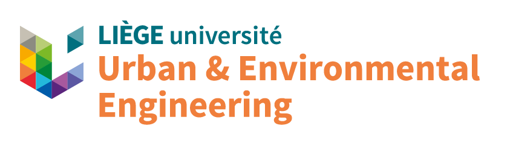
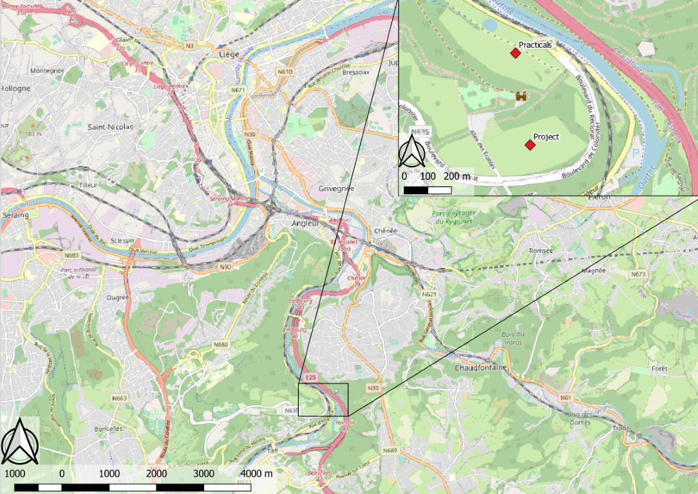
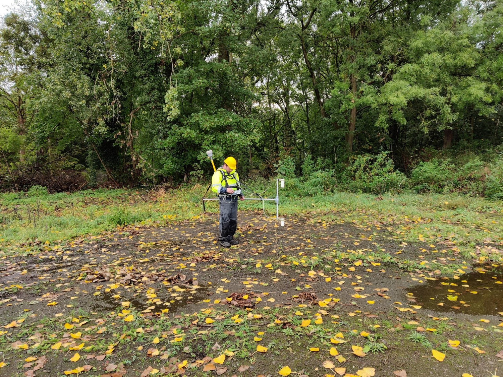
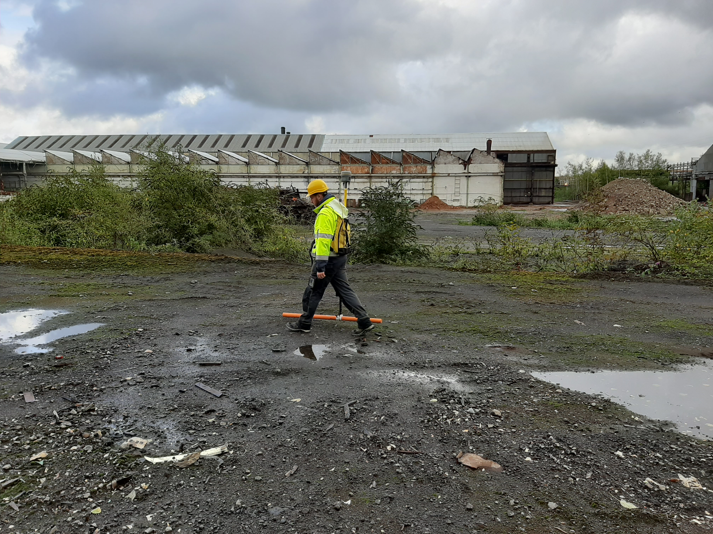
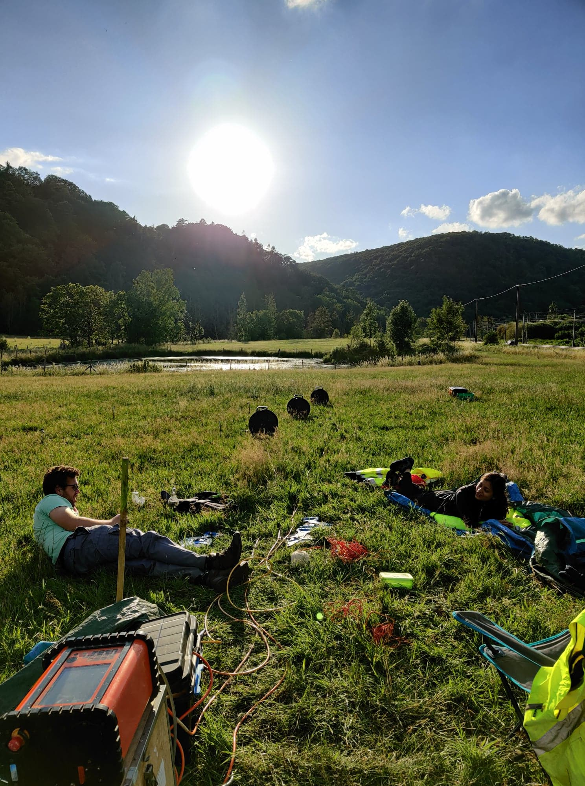
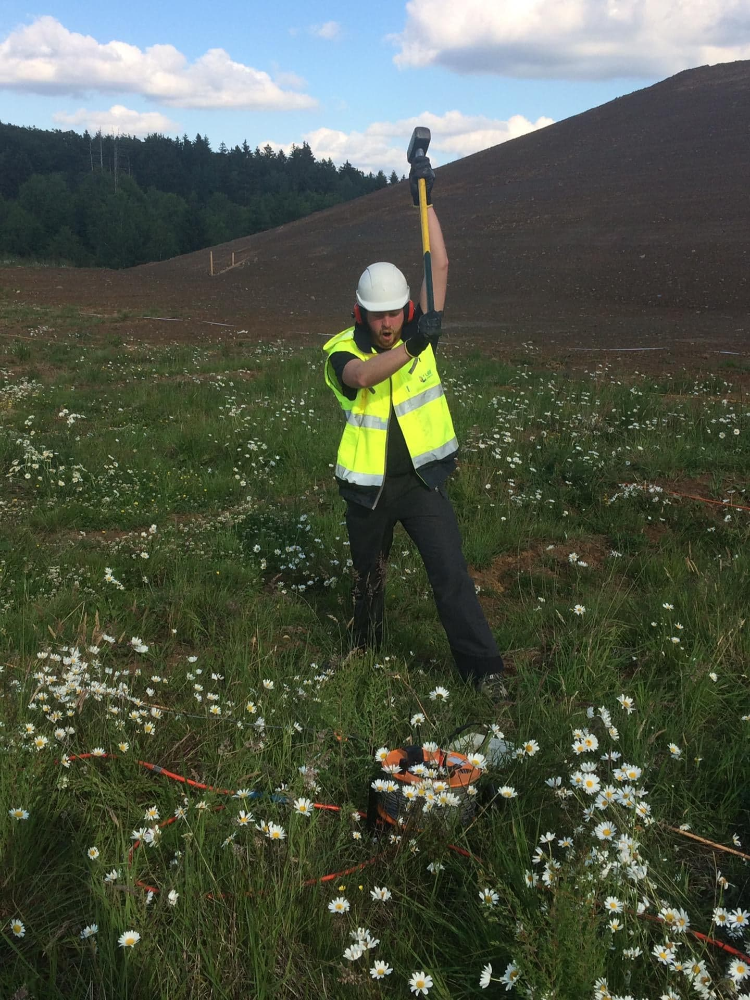

---
# PROSPGEOP
This repository contains all the codes for the practicals of the class "Prospection Géophysique" from Pr. NGUYEN (ULiège). (The different codes are availble in Jupyter Notebook form, there is thus no need to download anything since everything can run inside the web browser through the Binder app.)

During those practicals, you will see different geophysical methods, how to interpret them individually and integrate this interpretation inside a global geophysical model. The different geophysical methods are:
- MAG (Magnetic)
- EMI (ElectroMagnetic Induction)
- ERT (Electrical Resistivity Tomography)
- IP (Induced Polarisation)
- Seismic Refraction

For those practicals, we will see several case studies. Nonetheless, one site will follow us during this whole semester: Colonster. On this site, you will see how the different datasets can completre one-another.

*Fig.1: Colonster site location*

---
# Practicals in short
## MAG

*Fig.2: Example of an EMI survey*

Magnetic surveys are often conducted to rapidely map magneticaly succeptible anomalies in a (relatively) large area. As so, interpretation of magnetic data is very often made using profiles or maps. Typical applications of such method are:
- Mining prospection
- Archeology

> During this practicals, you will learn how to convert raw MAG data into maps that can be interpreted in terms of anomalies and emit hypothesis on the nature of the anomalies observed given the geological and geophysical context.

Sites: Onoz? and Colonster

## EMI

*Fig.3: Example of an EMI survey*

As for MAG surveyx, EMI is often used to rapidely cover large areas. EMI is typically applied to: 
- Mining prospection
- Archeology
- Water management

> During this practicals, you will learn how to convert raw EMI data into maps that can be interpreted in terms of anomalies and emit hypothesis on the nature of the anomalies observed given the geological and geophysical context.

Sites: Westhoek and Colonster

## ERT

*Fig.4: Example of an ERT/IP survey*

ERT is typically applied to:
- Mining prospection
- Water management
- Civil engineering

> During this practicals, you will learn:
> - How to analyze raw ERT data
> - How to get a model of the subsurface from ERT data
> - How to interpret resisivity models

Sites: Bertrix and Colonster

## IP
IP is often measured alongside ERT measurements, since time-domain IP (the one that we will use here) is measured directly after the resistivity measurements.
IP is typically applied to:
- Mining prospection
- Water management
- Civil engineering

> During this practicals, you will learn:
> - How to analyze raw IP data and detect erroneous data
> - How to get a model of the subsurface from IP data
> - How to interpret chargeability models

Sites: Spa and Colonster

## Seismic

*Fig.5: Example of a seismic survey*
Seismic is typically used for:
- Civil engineering
- Mining prospection

> During this practicals, you will learn:
> - How to analyze raw seismic data
> - How to pick the first arrival of a seismic wave
> - How to get a model of the subsurface hodochrones
> - How to interpret ground velocity models

Sites: Beusdael? and Colonster

---
# Project
At the end of the semester, you will be asked to go on the field with one of the methods seen in class and availble in our laboratory. The available equipment is:
- EMI (CMD Mini-Explorer from GF Instruments)
- ERT/IP (ABEM LS from ABEM)
- Seismic (??? from ???)

You will work in groupds of 4 on the "Project" area of *Fig.1*. There will be 2 teams working with EMI, 4 teams with ERT/IP and 3 teams with seismics.

You will be asked to interpret your dataset and show your prossess and conclusions in a short (10 minutes) group presentation. After every presentation, you will benefit from a feedback from the teaching team and you will need to write a short report on your investigation (10 pages maximum) taking into account our remarks.

For the last class, we will take all your interpretations together and build a coherent geophysical model for the site.

---
# Contacts
Always send an e-mail before comming in our offices for questions. We will inform you on our availabilies. Use the links below to send e-mails:
## Professor: 
- Frédéric Nguyen ([f.nguyen@uliege.be](mailto:f.nguyen@uliege.be?subject=[GEOL0021-7]%20Github%20repository))
## Teaching assistants:
- Tom Debouny ([tom.debouny@uliege.be](mailto:tom.debouny@uliege.be?subject=[GEOL0021-7]%20Github%20repository))
- Hadrien Michel ([hadrien.michel@uliege.be](mailto:hadrien.michel@uliege.be?subject=[GEOL0021-7]%20Github%20repository))
## Github Maintenance:
- Hadrien Michel ([hadrien.michel@uliege.be](mailto:hadrien.michel@uliege.be?subject=[GEOL0021-7]%20Github%20repository%20maintenance))