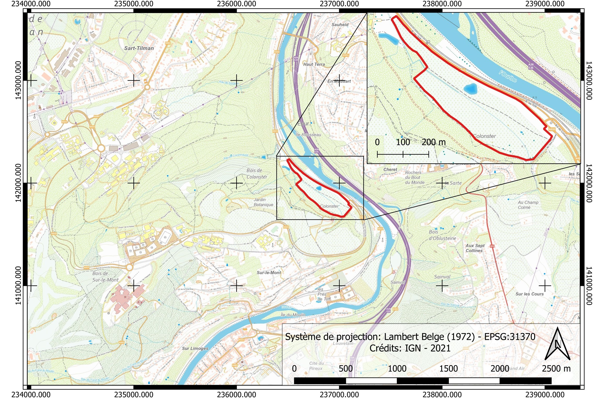

---
# PROSPGEOP
Ce répertoire contient les codes nécéssaire aux travaux pratiques du cours de Prospection Géophysique du Pr. NGUYEN (ULiège). 

Durant les travaux pratiques, vous aller voir différentes méthodes géophysisques, comment les intérprètées individuellement et l'intégration des différentes interprétations dans un modèle global reprenant l'ensemble des méthodes applicables sur un site. Les différentes méthodes vues sont:
- MAG (Magnétique)
- EMI (Induction électromagnétique)
- ERT (Tomographie de résistivité électrique)
- IP (Polarisation induite)
- SIS (Sismique réfraction)

Pour ces travaux pratiques, nous verrons plusieurs études de cas. Néanmoins, un site nous suivra tout au long de ce semestre : Colonster. Sur ce site, vous verrez comment les différents ensembles de données peuvent se compléter les uns les autres.

*Fig.1: Localisation du site de Colonster*

---
# Les travaux pratiques:

> ## Logiciels utiles:
> - Anaconda (Python): [https://www.anaconda.com/products/individual](https://www.anaconda.com/products/individual)
> - Paraview: [https://www.paraview.org/download/](https://www.paraview.org/download/)
> - RES2DINV (Windows seulement): [https://www.geotomosoft.com/Res2dinvx64_Setup.zip](https://www.geotomosoft.com/Res2dinvx64_Setup.zip)

## [ERT](./ERT_IP/README_ERTIP.md)

*Fig.2: Exemple de prises de mesures ERT/IP*

L'ERT est généralement appliqué à :
- Prospection minière
- Gestion de l'eau
- Génie civil

> Au cours de ces exercices pratiques, vous apprendrez :
> - Comment analyser les données brutes de l'ERT
> - Comment obtenir un modèle du sous-sol à partir des données de l'ERT
> - Comment interpréter les modèles de résistivité

## [IP](./ERT_IP/README_ERTIP.md)
L'IP est souvent mesuré en même temps que l'ERT, puisque l'IP dans le domaine temporel (celui que nous utiliserons ici) est mesuré directement après les mesures de résistivité.
L'IP est généralement appliqué à :
- La prospection minière
- Gestion de l'eau
- Génie civil

> Au cours de ces exercices pratiques, vous apprendrez :
> - Comment analyser les données IP brutes et détecter les données erronées
> - Comment obtenir un modèle du sous-sol à partir de données IP
> - Comment interpréter les modèles de chargeabilité

## [MAG](./MAG/README_MAG.md)

*Fig.3: Exemple de prises de mesures MAG*

Les études magnétiques sont souvent effectués pour cartographier rapidement les anomalies magnétiques dans une zone (relativement) étendue. Ainsi, l'interprétation des données magnétiques se fait très souvent à l'aide de profils ou de cartes. Les applications typiques de cette méthode sont les suivantes :
- Prospection minière
- Archéologie

> Au cours de ces travaux pratiques, vous apprendrez à convertir des données MAG brutes en cartes pouvant être interprétées en termes d'anomalies et à émettre des hypothèses sur la nature des anomalies observées compte tenu du contexte géologique et géophysique.

## [EMI](./EMI/README_EMI.md)

*Fig.4: Exemple de prises de mesures EMI*

Comme pour les études MAG, l'EMI est souvent utilisé pour couvrir rapidement de vastes zones. L'EMI est généralement appliqué à : 
- La prospection minière
- Archéologie
- Gestion de l'eau

> Au cours de ces travaux pratiques, vous apprendrez à convertir des données brutes EMI en cartes pouvant être interprétées en termes d'anomalies et à émettre des hypothèses sur la nature des anomalies observées compte tenu du contexte géologique et géophysique.

## [SIS](./Seismic/README_SIS.md)

*Fig.5: Exemple de prises de mesures sismiques*

La sismique est généralement utilisée pour :
- Génie civil
- Prospection minière

> Au cours de ces exercices pratiques, vous apprendrez :
> - Comment analyser des données sismiques brutes
> - Comment repérer la première arrivée d'une onde sismique
> - Comment obtenir un modèle du sous-sol sur base des hodochrones
> - Comment interpréter les modèles de vitesse du sol

---
# Projet:
À la fin du semestre, vous serez invité à vous rendre sur le terrain avec l'une des méthodes vues en classe et disponibles dans notre laboratoire. L'équipement disponible est :
- EMI (CMD Mini-Explorer de GF Instruments)
- ERT/IP (ABEM LS de l'ABEM)
- Sismique (DAQLink4 de Seismic Source Co.)

Vous travaillerez par groupes de 3. Il y aura 3 équipes travaillant avec EMI, 3 équipes avec ERT/IP et 3 équipes avec la sismique.

Il vous sera demandé d'interpréter votre ensemble de données et de montrer vos processus et conclusions dans une courte présentation de groupe (10 minutes). Après chaque présentation, vous bénéficierez d'un retour de la part de l'équipe pédagogique et vous devrez rédiger un court rapport sur votre étude (10 pages maximum) en tenant compte de nos remarques.

Pour le dernier cours, nous prendrons en compte toutes vos interprétations et construirons un modèle géophysique cohérent pour le site.

---
# Contacts:
Envoyez toujours un e-mail avant de venir dans nos bureaux pour des questions. Nous vous informerons de nos disponibilités. Utilisez les liens ci-dessous pour envoyer des courriels :
## Professeur: 
- Frédéric Nguyen ([f.nguyen@uliege.be](mailto:f.nguyen@uliege.be?subject=[GEOL0021-7]%20Github%20repository))
## Assistants:
- Tom Debouny ([tom.debouny@uliege.be](mailto:tom.debouny@uliege.be?subject=[GEOL0021-7]%20Github%20repository))
- Hadrien Michel ([hadrien.michel@uliege.be](mailto:hadrien.michel@uliege.be?subject=[GEOL0021-7]%20Github%20repository))
## Maintenance Github:
- Hadrien Michel ([hadrien.michel@uliege.be](mailto:hadrien.michel@uliege.be?subject=[GEOL0021-7]%20Github%20repository%20maintenance))