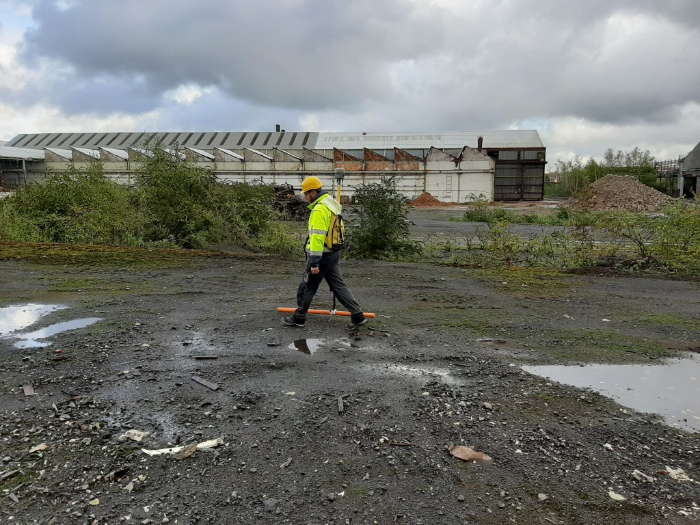

---
# PROSPGEOP
Ce répertoire contient les codes nécéssaire aux travaux pratiques du cours de Prospection Géophysique du Pr. NGUYEN (ULiège). 

Durant les travaux pratiques, vous aller voir différentes méthodes géophysiques, comment les intérprèter individuellement et comment intégrer les différentes interprétations dans un modèle global reprenant l'ensemble des méthodes applicables sur un site. Les différentes méthodes vues sont:
- EMI (Induction électromagnétique)
- ERT (Tomographie de résistivité électrique)
- IP (Polarisation induite)
- SIS (Sismique réfraction)
- GRAVI (Gravimétrie)

Pour ces travaux pratiques, nous verrons plusieurs études de cas. Néanmoins, un site servira de fil rouge tout au long de ce semestre : Colonster. Sur ce site, vous verrez comment les différents ensembles de données peuvent se compléter les uns les autres.

*Fig.1: Localisation du site de Colonster*

---
# Les travaux pratiques:

> ## Logiciels utiles:
> - Anaconda (Python): [https://www.anaconda.com/products/individual](https://www.anaconda.com/products/individual)
> - Paraview: [https://www.paraview.org/download/](https://www.paraview.org/download/)
> - RES2DINV (Windows seulement): [https://www.geotomosoft.com/Res2dinvx64_Setup.zip](https://www.geotomosoft.com/Res2dinvx64_Setup.zip)
> - QGIS: [https://www.qgis.org/fr/site/forusers/download.html](https://www.qgis.org/fr/site/forusers/download.html)
> 
> Il vous sera également demander d'installer certains packages python et de créer des environnement spécifiques pour certaines tâches dans les TP.

## [ERT](./ERT_IP/README_ERTIP.md)

*Fig.2: Exemple de prise de mesures ERT/IP*

L'ERT est généralement appliquée à :
- Prospection minière
- Gestion de l'eau
- Génie civil

> Au cours de ces exercices pratiques, vous apprendrez :
> - Comment analyser les données brutes de l'ERT
> - Comment obtenir un modèle du sous-sol à partir des données de l'ERT
> - Comment interpréter les modèles de résistivité
> - Comment évaluer la fiabilité des modèles obtenus

## [IP](./ERT_IP/README_ERTIP.md)
L'IP est souvent mesurée en même temps que l'ERT, puisque l'IP dans le domaine temporel (celui que nous utiliserons ici) est mesurée directement après les mesures de résistivité.
L'IP est généralement appliquée à :
- La prospection minière
- Gestion de l'eau
- Génie civil

> Au cours de ces exercices pratiques, vous apprendrez :
> - Comment analyser les données IP brutes et détecter les données erronées
> - Comment obtenir un modèle du sous-sol à partir de données IP
> - Comment interpréter les modèles de chargeabilité
> - Comment évaluer la fiabilité des modèles obtenus

## [SIS](./Seismic/README_SIS.md)

*Fig.5: Exemple de prise de mesures sismiques*

La sismique est généralement utilisée pour :
- Génie civil
- Prospection minière

> Au cours de ces exercices pratiques, vous apprendrez :
> - Comment analyser des données sismiques brutes
> - Comment repérer la première arrivée d'une onde sismique
> - Comment obtenir un modèle du sous-sol sur base des hodochrones
> - Comment interpréter les modèles de vitesse du sol

## [EMI](./EMI/README_EMI.md)

*Fig.4: Exemple de prise de mesures EMI*

Comme pour les études MAG, l'induction électromagnétique est souvent utilisée pour couvrir rapidement de vastes zones. L'EMI est généralement appliquée à : 
- La prospection minière
- Archéologie
- Gestion de l'eau

> Au cours de ces travaux pratiques, vous apprendrez à convertir des données brutes EMI en cartes pouvant être interprétées en termes d'anomalies et à émettre des hypothèses sur la nature des anomalies observées compte tenu du contexte géologique et géophysique.

## [GRAVI](./GRAVI/README_GRAVI.md)

*Fig.4: Exemple de prise de mesures gravimétriques*

La gravimétrie a de nombreux domaines d'utilisation possible: 
- La prospection minière
- La détection de vide/ failles
- La gestion de l'eau ou des sources géothermiques
- Tout ce qui implique un changement de densité du milieu  

> Au cours de ces travaux pratiques, vous apprendrez à appliquer toutes les corrections nécessaires aux données brutes pour une interprétation adéquate des résulats obtenus. De plus, vous apprendrez à générer un modèle direct et à voir l'impact d'une modification de celui-ci sur les données obtenues. 

---
# Projet:
À la fin du semestre, vous serez invités à vous rendre sur le terrain avec l'une des méthodes vues en classe et disponibles dans notre laboratoire. L'équipement disponible est :
- EMI (CMD Mini-Explorer de GF Instruments)
- ERT/IP (ABEM LS d'ABEM)
- Sismique (DAQLink4 de Seismic Source Co.)

Vous travaillerez par groupes de 3 ou 4.

---
# Contacts:
Envoyez toujours un e-mail avant de venir dans nos bureaux pour des questions. Nous vous informerons de nos disponibilités. Utilisez les liens ci-dessous pour envoyer des courriels :
## Professeur: 
- Frédéric Nguyen ([f.nguyen@uliege.be](mailto:f.nguyen@uliege.be?subject=[GEOL0021-7]%20Github%20repository))
## Assistants:
- Tom Debouny ([tom.debouny@uliege.be](mailto:tom.debouny@uliege.be?subject=[GEOL0021-7]%20Github%20repository))
- Hadrien Michel ([hadrien.michel@uliege.be](mailto:hadrien.michel@uliege.be?subject=[GEOL0021-7]%20Github%20repository))
## Maintenance Github:
- Hadrien Michel ([hadrien.michel@uliege.be](mailto:hadrien.michel@uliege.be?subject=[GEOL0021-7]%20Github%20repository%20maintenance))