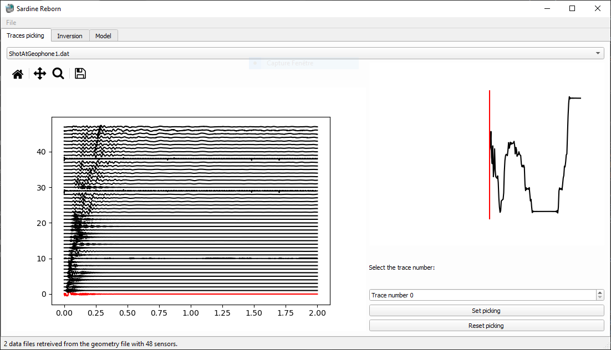
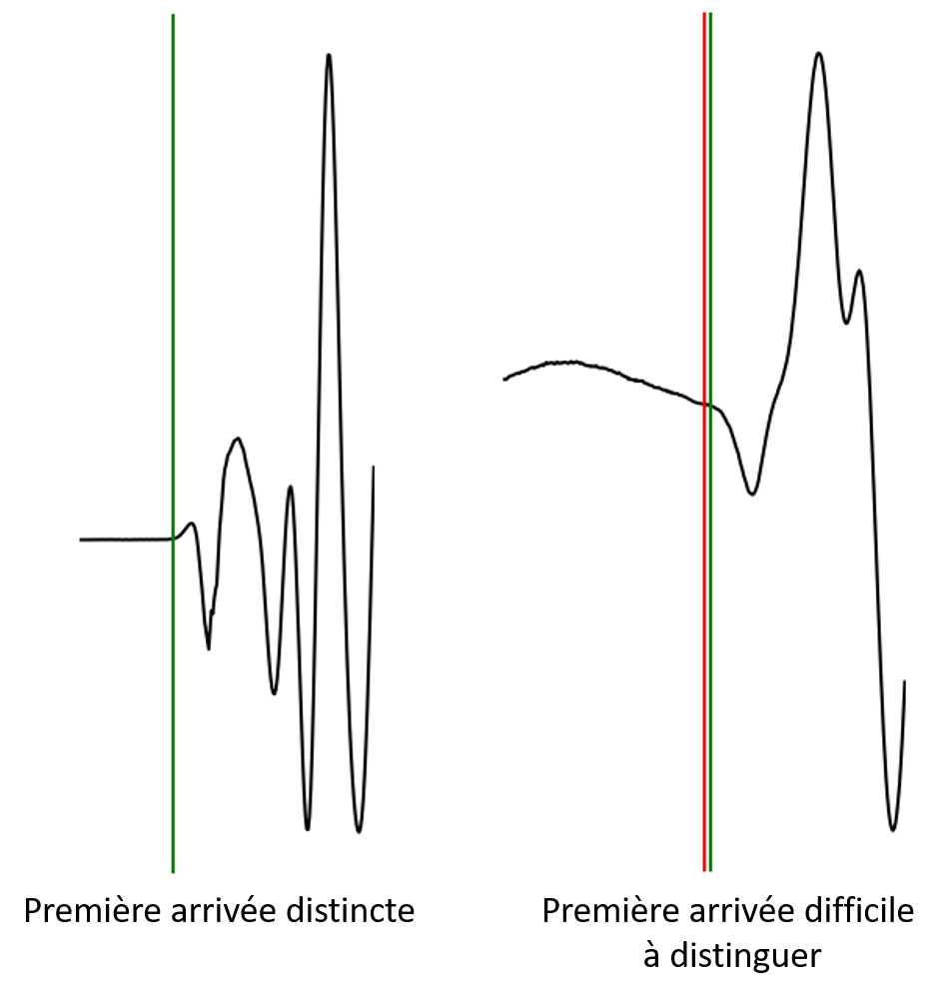
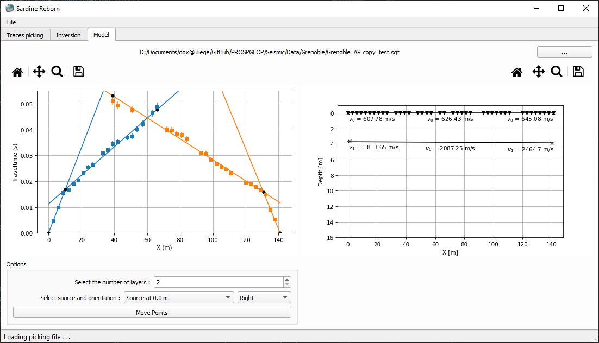
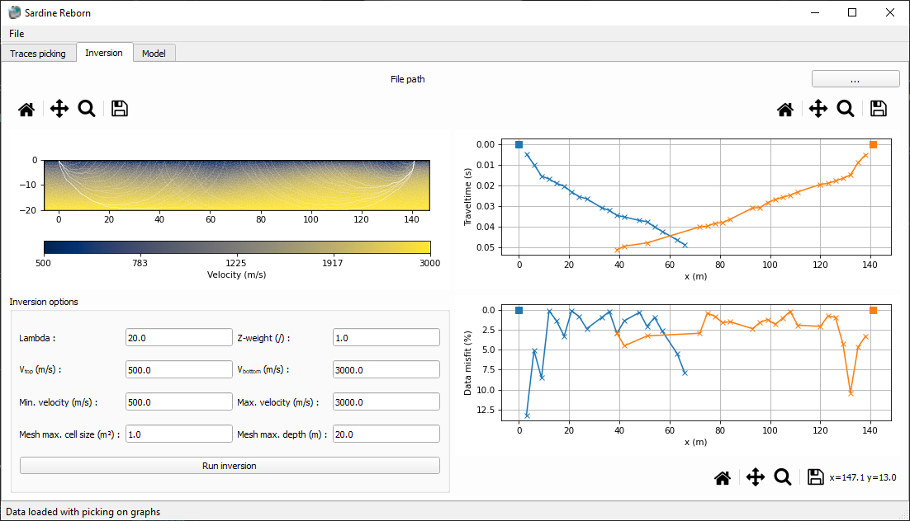

# Avant les travaux pratiques:
Pour ces travaux pratiques, nous allons avoir besoin de programmes Python. Il vous est donc demandé d'installer les différents programmes nécessaires pour ce cours. Pour cela, suivez la procédure suivante:

Téléchargez le code [Sardine Reborn](https://github.com/hadrienmichel/SardineReborn) au lien suivant: https://github.com/hadrienmichel/SardineReborn/releases/tag/v0.4.2. Dézipper l'archive téléchargée et localiser le répertoire (C:/my-directory).

Lancez `Anaconda prompt`, activer l’environnement `pg` construit pour le TP ERTIP et installer le paquet supplémentaire `obspy`
```
conda activate pg
conda install conda-forge::obspy
```

Dans l'environnement, vous pouvez entrer la commande suivante pour démarrer l'interface graphique:
```
python Interface.pyw
```

Le code se lance dans une nouvelle fenêtre.

# Acquisition des données sur le terrain
Les données de sismique réfraction peuvent être acquises de plusieurs manières sur le terrain. En général, on dispose les géophones en ligne avec un espacement régulier, bien qu'aucune règle ne l'impose explicitement. Ensuite, les géophones sont connectés à une station de mesure grâce à un câble multibrins.

Une fois le dispositif mis en place, il faut une source sismique pour générer un signal puissant dans le sol. Il existe plusieurs types de sources sismiques. La plus simple (masse) est aussi la plus répandue mais crée un signale plus faible et peu constant. Des sources automatisées permettent de mieux contrôler la source, mais sont difficiles à déplacer et beaucoup plus onéreuses. Dans le cadre d'acquisitions à grande échelle, il est possible d'utiliser des explosifs ou des camions vibrants comme source, mais ces derniers dispositifs nécessitent des autorisations particulières et sont particulièrement chers.

# Détection des premières arrivées
Pour la sismique réfraction, la propriété qui nous intéresse dans le signal sismique est le temps de première arrivée. Il nous faut donc sélectionner ce temps de première arrivée au sein des traces sismiques. Pour cela, divers algorithmes existent, cependant, cependant pour des fins pédagogiques, nous allons pointer manuellement les premières arrivées. Ceci permettra de mieux distinguer les potentiels problèmes liés aux méthodes sismiques.

Pour pointer un signal sismique (picking), nous allons utiliser le code [Sardine Reborn](https://github.com/hadrienmichel/SardineReborn) précédemment téléchargé. Ce code prend en entrée un fichier `\*.geometry` (fichier texte avec tabulations comme séparateur). Le fichier `\*.geometry` renseigne les différents fichiers à piquer (aller, retour, etc.) avec la position de leur source. Ensuite, la liste des positions (x,y) des géophones est donnée. Il s'agit ici des positions (x,y) locales le long d'une droite (x) avec la topographie (y) et non des coordonnées globales. Un [exemple](./Data/Hermalle/Hermalle.geometry) de fichier `\*.geometry` est montré ci-dessous:
```txt
SOURCES
geophone1.sg2    0    0
geophone24.sg2    57.5    0
RECEIVERS
0    0
2.5    0
5    0
.
.
.
52.5    0
55    0
57.5    0
```
Pour charger le fichier, utiliser le menu `File` et sélectionner l'option `Open geometry file` (ou le raccourci clavier `CTRL+O`). Une fois le fichier chargé, le signal s'ouvre dans la fenêtre `Picking` du logiciel.

---
### NB: Cette fenêtre peut être lente. Merci d'être patient pendant l'utilisation!
---

La fenêtre est divisée en 2 partie (*Fig.1*). Sur la partie gauche, vous avez les différentes traces sismiques. La trace rouge est la trace en cours d'analyse. Un zoom sur la trace en cours d'analyse est montré sur la partie droite de la figure.

  
*Figure 1: Fenêtre de picking des premières arrivées*

Il est possible de sélectionner le fichier sur lequel le picking est réalisé dans le menu au-dessus. La sélection du signal à piquer est faite via le sélecteur `Trace number x`. Pour sélectionner une première arrivée, faites un clic gauche à l'emplacement voulu. Par défaut, chaque première arrivée sera accompagnée d'une erreur de 3%. L'erreur peut être sélectionnée manuellement pour mieux correspondre à la réalité du signal. Pour cela, faites un clic droit à la distance voulue de la première arrivée.

Une fois le picking réalisé,  sélectionnez le bouton `Set picking` pour fixer votre sélection (et regagner des performances graphiques). Si vous souhaitez recommencer a 0 le picking, utilisez le bouton `Reset picking`.

## Piquer les premières arrivées:
Dans un ensemble de traces sismiques, il est important de bien pouvoir distinguer différents éléments du signal. Ainsi, il est aisé de détecter différentes parties dans les traces:
- Première arrivée: c'est l'instant auquel arrive la première onde (la plus rapide). Il s'agit du temps de parcours de l'onde directe ou de l'onde réfractée qui nous intéresse dans le cadre de ces travaux pratiques.
- Onde sonore: elle est facilement distinguable dans un train d'onde sismique parce que sa vitesse est constante (environ 300 m/s) et son amplitude est forte.
- Ondes de surfaces: ce train d'ondes présente une forte amplitude et voyage plus lentement que les ondes de compression (P). Ces ondes se dispersent avec la distance, c'est-à-dire que plus le géophone est éloigné de la source, plus leur présence dans le temps sera importante.
- Bruit: il s'agit de variations brutes dans le signal qui ont une fréquence variable. Leur présence est problématique et peut parfois cacher le signal sismique (présence de sources de bruit sismique à proximité du site d'acquisition). Cette partie du signal doit être diminuée au maximum pour permettre une interprétation efficace du signal sismique. Malheureusement, pour diminuer le bruit, il faut procéder à ce que l'on appelle le stacking. Cette procédure permet d'additionner des signaux similaires pris à des temps différents. Le bruit étant aléatoire, son influence n'est pas la même dans tous les signaux et la valeur moyenne du bruit est nulle (normalement). Sur un site peu bruité, il faudra stacker 2 à 5 fois alors que sur un site bruité, il peut être nécessaire de stacker jusqu'à 100 fois voire plus pour avoir un signal de qualité.

Une bonne pratique pour piquer les premières arrivées est de d'abord zoomer sur le graphique sur le temps avant l'arrivée de l'onde sonore. Ainsi, le temps sélectionné sera plus précis. Ensuite, pour naviguer dans la fenêtre, il faut utiliser la souris ainsi que les flèches du clavier. Avec les flèches haut et bas, vous pouvez passer à la trace suivante/précédente alors qu'avec la souris, vous pouvez sélectionner le temps de première arrivée en cliquant. Une fois le temps sélectionné pour tous les géophones où le signal est suffisamment clair, quitter la fenêtre et passer au signal suivant.

La première arrivée est marquée par la première perturbation dans le signal. Malheureusement, cette première arrivée est rarement très clairement marquée comme nous pouvons le voir en *Fig.2*. Il est même possible que de temps en temps, il soit impossible de piquer correctement le temps de première arrivée.

  
*Figure 2: Piquer les premières arrivées: pas toujours facile*

## Sauvegarder les premières arrivées:

Pour sauver la sélection dans un fichier `*.sgt`, utiliser le menu `File` et l'option `Save current picking` (raccourci clavier: `CTRL+P`). Ce fichier suit le standard "Unified Data Format" et se présente sous la forme suivante:
```txt
24 # shot/geophone points
#x    y
0.00    0.00
2.00    0.00
.
.
.
44.00    0.00
46.00    0.00
24 # measurements
#s    g    t
1    1    0
1    2    0.0020
1    3    0.0040
.
.
.
1    23    0.0260
1    24    0.0265
```
La première section reprend les positions des géophones (et des sources éventuelles en dehors du set de géophones). La deuxième section reprend les données de terrain dans un format simple avec le numéro de la source, du récepteur et la donnée (dans ce cas, le temps de première arrivée).

# Interprétation des données
Une fois le temps de la première arrivée sélectionné, nous pouvons interpréter le jeu de données. Pour cela, nous allons utiliser deux approches qui sont adaptées dans des cas différents.
- Modèle de Snell-Descartes (Mota)
- Tomographie des temps de première arrivée (travel-time tomography)

Dans le cadre de ces travaux pratiques, seule la première méthode sera utilisée.

Dans les deux cas, le jeu de données sera inversé à l'aide du module d'inversion de PyGimli.
## 1) Modèle de Snell-Descartes
Ce modèle est extrêmement simple et utilise un modèle conceptuel approchant la réalité comme une succession de couches pouvant être inclinées et agissant comme réfracteurs (contraste de vitesse entre deux milieux). Ce modèle se base sur les lois de la physique des ondes et plus particulièrement sur la réfraction (angle critique de Snell).

Ce modèle est adapté dans des cas simples, en l'absence de topographie (ou topographie faible). Il a cependant certaines limitations, particulièrement au niveau des types de couches qu'il est capable de détecter. Ainsi, une des premières hypothèses d'un tel modèle est la superposition de couches de vitesses croissantes avec la profondeur.

Pour réaliser une inversion du jeu de données avec cette approche, utilisez la fenêtre `Model` (*Fig.3*) et suivez les instructions à l'écran.

Le modèle final obtenu est présenté sous forme d'un graphique avec les interfaces ainsi que les vitesses des ondes P dans les différentes couches.

  
*Figure 3: Modèle de Snell-Descartes (Mota)*

## 2) Tomographie des temps de première arrivé (travel-time tomography)
Dans ce cas-ci, il est possible d'obtenir des modèles beaucoup plus détaillés avec des structures complexes. Elle résout le modèle direct par éléments finis au lieu d'utiliser une approche simplifiée du modèle. Par conséquent, les résultats peuvent ici rendre compte de détails impossibles à obtenir avec l'approche précédente. Cependant, cette approche nécessite plus de données pour pouvoir être efficacement appliquée. En effet, il s'agit ici d'une inversion sur un problème mal posé, qui, si mal contraint, peut mener à des résultats absurdes.

Pour réaliser une inversion du jeux de données avec cette approche, utilisez la fenêtre `Inversion` (*Fig.4*) et suivez les instructions à l'écran.

  
*Figure 4: Module d'inversion des données*

Le modèle final obtenu est présenté sous forme d'une image de la distribution des vitesses sismiques dans le sol. Une analyse de l'erreur obtenue sur le résultat est présentée en parallèle.


