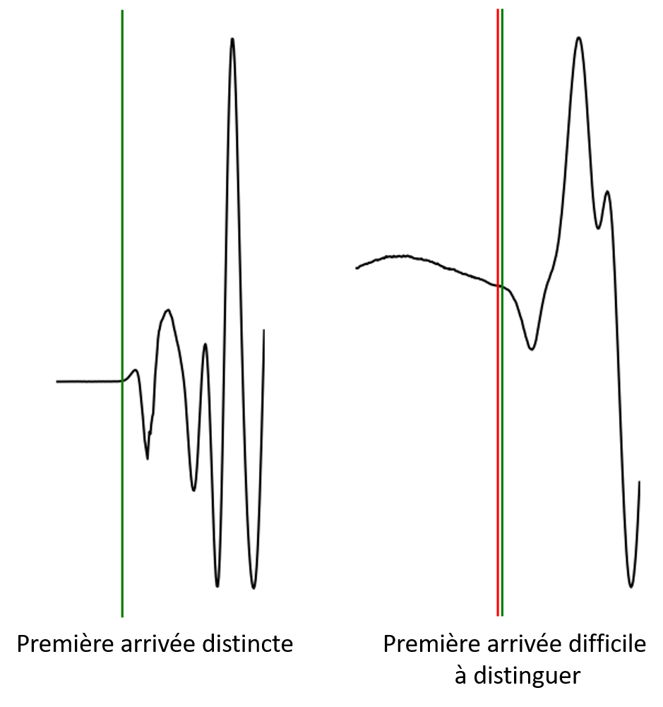

# Avant les travaux pratiques:
Pour ces travaux pratiques, nous allons avoir besoin de programmes Python. Il vous est donc demandé d'installer les différents programmes nécéssaire pour ce cours. Pour cela, suivez la procédure suivante:
 - Télécharger les codes via le lien suivant ([https://downgit.github.io/#/home?url=https://github.com/hadrienmichel/PROSPGEOP/tree/master/Seismic/Codes](https://downgit.github.io/#/home?url=https://github.com/hadrienmichel/PROSPGEOP/tree/master/Seismic/Codes))
 - Installer [PyGimli](https://www.pygimli.org/)
 - Installer [ObsPy](https://github.com/obspy/obspy/wiki)

Vous pouvez réaliser les 2 derniers points en utilisant les commandes suivantes dans l'invite de commande (MacOS ou Linux) ou dans `Anaconda Prompt` (Windows)
```bash
conda config --add channels conda-forge
conda install -c gimli pygimli
conda install obspy
```
Ensuite, il vous suffit de lancer les codes téléchargés au point 1 pour réaliser les exercices.

# Acquisition des données sur le terrain
Les données de sismique réfraction peuvent être acquise de plusieurs manières sur le terrain. En général, on disposera les géophones en ligne avec un espacement régulier, bien qu'aucune règle ne contraigne cela. Ensuite, les géophones sont connecté a une station de mesure grâce a un cable multi-brins. 

Une fois le dispositif mis en place, il faut une source sismique pour générer un signal puissant dans le sol. Il existe plusieurs type de sources sismiques. La plus simple (masse) est aussi la plus répendue mais crée un signale plus faible et peu constant. Des sources automatisées permettent de mieux contrôler la source, mais sont difficiles a déplacer et beaucoup plus honnéreuses. Dans le cadre d'aquisitions à grande échelle, il est possible d'utiliser des explosifs ou des camions vibrants comme source, mais ces derniers dispositifs nécessaites des autorisations particulières et sont particulièrement chers.

# Détection des premières arrivées
Pour la sismique réfraction, le propriété qui nous intéresse dans le signal sismique est le temps lors de la première arrivée. Il nous faut donc sélectionner ce temps de première arrivée hors des traces sismiques. Pour cela, divers algorithmes existe, cependant, a fin pédagogique, nous allons piquer manuellement les premières arrivées. Ceci permettra de mieux distinguer les potentiels problèmes liés aux méthodes sismiques.

Pour piquer un signal sismique, nous allons utiliser le code [`PickSeismicTraces.py`](./Codes/PickSeismicTraces.py) que vous avez téléchargé. Ce code prends en entrée un fichier '\*.geometry' (fichier text avec tabulations comme séparateur). Le fichier '\*.geometry' renseigne les différents fichiers a piquer (aller, retour, etc.) avec la position de leur source. Ensuite, la liste des positions (x,y) des géophones est donnée. Il s'agit ici des positions (x,y) locales le long d'une droite (x) avec la topographie (y) et non des coordonnées globales. Un [exemple](./Data/Hermalle/Hermalle.geometry) de fichier '\*.geometry' est montré ci-dessous:
```txt
SOURCES
geophone1.sg2	0	0
geophone24.sg2	57.5	0
RECEIVERS
0	0
2.5	0
5	0
.
.
.
52.5	0
55	0
57.5	0
```
Une fois ce ficiher chargé, une nouvelle fenêtre s'ouvre. Il est vivement conseillé de mettre cette fenêtre en mode plein écran avant toute chose. En effet, cette fenêtre vous permettra de piquer les premières arrivées pour le premier des fichiers référencé dans le fichier '\*.geometry'. Plus la fenêtre est grande, plus le détails sur la première arrivée sera bien capturée.

La fenêtre est divisée en 2 partie (*Fig.1*). Sur la partie gauche, vous avez les différentes traces sismiques. La trace rouge est la trace en cours d'analyse. Un zoom sur le trace en cours d'analyse est montré sur la partie droite de la figure.

  
*Figure 1: Fenêtre de picking des premières arrivées*

---
### NB: Cette fenêtre peut être lente. Merci d'être patient pendant l'utilisation! 
---

## Piquer les premières arrivées:
Dans un ensemble de traces sismiques, il est important de bien pouvoir distinguer différents éléments du signal. Ainsi, il est aisé de détecter différentes parties dans les traces:
- Première arrivé: c'est l'instant auquel arrive la première onde (la plus rapide). Il s'agit du temps de parcourt de l'onde réfractée qui nous intéresse dans le cadre de ce travaux pratique.
- Onde sonore: elle est facilement distingueable dans un train d'onde sismique parce que sa vitesse est constante (environ 300m/s) et sont amplitude est forte.
- Ondes de surfaces: ce train d'ondes présente une forte amplitude et voyage plus lentement que les ondes de compression (P). Ces ondes se dispersent avec la distance, c'est-à-dire que leur présence dans le temps sera plus importante plus le géophone est éloigné de la source.
- Bruit: il s'agit de variations brutes dans le signal qui ont une fréquence variable. Leur présence est problématique est peut parfois cacher le signal sismique (présence de sources de bruit sismique a proximité du site d'aquistion). Cette partie du signal doit être diminuée au maximum pour permettre une interprétation efficace du signal sismique. Malheureusement, pour diminuer le bruit, il faut procéder à ce que l'on appel le stacking. Cette procédure additionne des signaux similaires pris a des temps différents. Le bruit étant aléatoire, son influence n'est pas la même dans tous les signaux et la valeur moyenne du bruit est nulle (normalement). Sur un site peu bruité, il faudra stacker 2 à 5 fois alors que sur un site bruité, il peut être nécéssaire de stacker jusqu'à 100 fois voir plus pour avoir un signal de qualité.

Une bonne pratique pour piquer les premières arrivées est de d'abord zoomer le graphique sur le temps avant l'arrivée de l'onde sonore. Ainsi, le temps sélectionné sera plus précis. Ensuite, pour naviguer dans la fenêtre, il faut utiliser la souris aisni que les flèches du clavier. Avec les flèches haut et bas, vous pouvez passer à la trace suivante/précédente alors qu'avec la souris, vous pouvez sélectionner le temps de première arrivée en cliquant. Une fois le temps sélectionné pour tous les géophones où le signal est suffisement clair, quitter la fenêtre et passer au signal suivant.

La première arrivée est marquée par la première perturbation dans le signal. Malheursement, cette première arrivée est rarement très clairement marquée comme nous pouvons le voir en *Fig.2*. Il est même possible que de temps en temps, il soit impossible de piquer correctement le temps de première arrivée.

  
*Figure 1: Piquer les premières arrivées: pas toujours facile*

## Sauvergarder les premières arrivées:
Une fois le picking des différents fichiers réalisé, les temps sélectionnés seront sauvegarder dans un nouveau fichier `FirstArrival.sgt`. Ce fichier suit le standard "Unified Data Format" et se présente sous la forme suivante:
```txt
24 # shot/geophone points
#x	y
0.00	0.00
2.00	0.00
.
.
.
44.00	0.00
46.00	0.00
24 # measurements
#s	g	t
1	1	0
1	2	0.0020
1	3	0.0040
.
.
.
1	23	0.0260
1	24	0.0265
```
La première section reprends les positions des géophones (et des sources éventuelles en dehors du set de géophones). La deuxième section reprends les données de terrain dans un format simple avec le numéro de la source, du recepteur et la donnée (dans ce cas, le temps de première arrivée).

# Interprétation des données
Une fois le temps de première arrivée sélectionné, nous pouvons interprèter le jeu de donnée. Pour cela, nous allons utiliser deux approches qui sont adaptées dans des cas différents.
- Modèle de Snell-Descartes
- Tomographie des temps de première arrivée (travel-time tomography)

Dans le cadre de ces travaux pratiques, seul la première méthode sera utilisée.

Dans les deux cas, le jeux de données sera inversé à l'aide du module d'inversion de PyGimli.
## 1) Modèle de Snell-Descartes
Ce modèle est extrèmement simple et approche la réalitée en utilisant une succession de couches pouvant être inclinées agissant comme réfracteurs (contraste de vitesse entre deux milieu). Ce modèle se base sur les lois de la physique des ondes et plus particulièrement sur la réfraction (angle critique de Snell).

Ce modèle est adapté dans des cas simples, en l'abscence de topographie (ou topographie faible). Il a cependant certaines limitations, particulièrement au niveau des type de couches qu'il est capable de détecter. Ainsi, une des premières hypothèses d'un tel modèle est la supperposition de couches de vitesses croissants avec la profondeur.

Pour résaliser une inversion du jeux de données avec cette approche, lancez le code [`FrontSnellDescartes.py`](./Codes/FrontSnellDescartes.py) et suivez les instructions a l'écran.

Le modèle final obtenu est présenté sous forme d'un graphique avec les interfaces ainsi que les vitesses des ondes P dans les différentes couches.

## 2) Tomographie des temps de première arrivé (travel-time tomography)
Dans ce cas-ci, il est possible d'obtenir des modèles beaucoup plus détaillés avec des structures complexes. Elle résout le modèle direct par éléments finis au lieu d'utiliser une approche simplifiée du modèle. Par conséquent, le résultats peuvent ici rendre compte de détails impossible a obtenir avec l'approche précédante. Cependant, cette approche nécéssite plus de données pour pouvoir être efficacement appliquée. En effet, il s'agit ici d'une inversion sur un problème mal posé, qui si mal contraint, peut ammener à des résultats absurdes.

Pour résaliser une inversion du jeux de données avec cette approche, lancez le code [`TravelTimeTomography.py`](./Codes/TravelTimeTomography.py) et suivez les instructions a l'écran.

Le modèle final obtenu est présenté sous forme d'une image de la distributions des vitesses sismiques dans le sol. Comme pour l'inversion en [ERT/IP](../ERT_IP/README_ERTIP.md) une image de la sensibilité du modèle est égamelent donnée.


